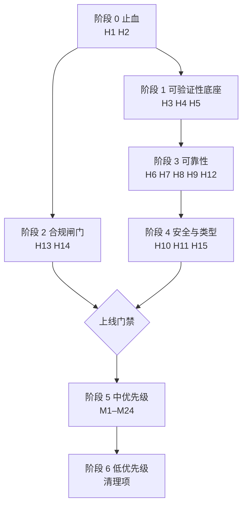

# Super Time 上线实施计划

> 来源：2026-09 全面架构与代码审查（架构分层 / 模块划分 / 依赖关系 / 核心流程 / 代码质量 / 测试覆盖 / 错误处理 / 性能 / 依赖与安全 / UI 体验 / 文档完整度）。
> 用途：**任务计划与实施跟踪**。每个条目都有稳定的 ID、依赖关系与可执行的验收标准。
> 结论基线：**当前不具备上线条件**。高优先级项全部闭环是上线的前置条件。

---

## 一、如何使用本文档

**状态取值**（每个条目详情块中的「状态」字段）：

| 状态 | 含义 |
|---|---|
| `未开始` | 尚未动手 |
| `进行中` | 有人在做，尚未提交 |
| `待验收` | 代码已改完，等待按验收标准复验 |
| `已完成` | 验收标准已逐条通过，并记录了证据 |
| `已延期` | 本轮不做，需注明原因与重排计划 |

**跟踪规则**：

1. 状态变化时，**同时**更新条目详情块的「状态」与本阶段的汇总表，两处必须一致。
2. `待验收 → 已完成` 必须附「验证方式」的实际执行结果（命令 + 输出摘要），不接受「看起来没问题」。
3. 「变更记录」章节（文末）按时间倒序追加，记录谁在何时把哪个 ID 从什么状态改到什么状态。
4. 新增审查发现时，追加新 ID，不要复用旧 ID。

**预估单位**：`d` = 人日。仅用于排序参考，不是承诺。

---

## 二、进度总览

| 阶段 | 目标 | 条目数 | 未开始 | 进行中 | 待验收 | 已完成 |
|---|---|---|---|---|---|---|
| 阶段 0 | 止血：阻断发布的事故级问题 | 2 | 0 | 1 | 0 | 1 |
| 阶段 1 | 可验证性底座 | 3 | 0 | 0 | 0 | 3 |
| 阶段 2 | 合规闸门（并行推进） | 2 | 2 | 0 | 0 | 0 |
| 阶段 3 | 可靠性：超时、恢复、数据安全 | 5 | 2 | 0 | 0 | 3 |
| 阶段 4 | 安全加固与类型底座 | 3 | 2 | 1 | 0 | 0 |
| 阶段 5 | 中优先级：稳定性与性能 | 28 | 25 | 1 | 0 | 2 |
| 阶段 6 | 低优先级：清理与打磨 | 23 | 21 | 1 | 0 | 1 |
| **合计** | | **66** | **52** | **4** | **0** | **10** |

> 维护提示：改动任何条目状态后，请同步更新本表的四个计数与本阶段汇总表。

---

## 三、实施顺序与依赖

阶段 0 与阶段 2 可**立即并行**启动：阶段 2 是法务/合规流程，耗时不可压缩，越早启动越好。阶段 1 必须在阶段 3 之前完成——否则后续所有改动都无法回归验证。

**关键路径**：H1 → H2 → H3/H4/H5 → H7 → H8/H9 → H10/H11/H15 → 上线门禁。

---

## 四、阶段 0 · 止血（阻断发布）

这两项属于「发布即事故」级别，必须最先处理。H2 完成后，后续所有改动才有稳定的 diff 基线。

### 阶段汇总

| ID | 任务 | 依赖 | 预估 | 状态 |
|---|---|---|---|---|
| H1 | 清除已入库的真实密钥并轮换 | 无 | 0.5d | 未开始 |
| H2 | 收敛工作区与 HEAD 的脱节 | 无 | 1d | 未开始 |

---

### `[~]` H1 · 真实密钥已被 git 跟踪

- **状态**：进行中（仓库侧已完成；凭据轮换与历史重写待人工决策）　**依赖**：无　**预估**：0.5d
- **证据**：
  - `git ls-files wechat/` 列出 `wechat/config.json` 与 `wechat/llm.json`
  - `git show HEAD:wechat/llm.json` → `apiKey` 为一条真实 DeepSeek Key（形如 `sk-<32 位十六进制>`，此处不复制明文，避免二次泄露）
  - `git show HEAD:wechat/config.json` → `db_enc_key`、`image_aes_key` 明文（同样不复述）
  - **首轮遗漏、本轮补出**：`src/backend/wechat-data/tests/image-key.spec.ts` 有 3 处硬编码了与 config.json **同一个** `image_aes_key` 明文——首轮扫描只匹配 `sk-`/`AKIA`/`BEGIN PRIVATE KEY` 这类模式，漏掉了裸十六进制密钥。已替换为明显的假值（`0123456789abcdef`）
- **风险**：任何拿到仓库（含历史）的人可直接调用该 Key 消耗额度，并用 `db_enc_key` 解密该账号的微信数据库。
- **动作**：
  1. `git rm --cached wechat/config.json wechat/llm.json`
  2. `.gitignore` 追加 `wechat/*.json`（保留 `wechat/README.md`）
  3. 轮换凭据：作废并重发 DeepSeek API Key；重新获取微信 DB key / image key
  4. 清理 git 历史中的这两个文件（`git filter-repo` 或 BFG），并通知所有已克隆该仓库的人重新克隆
  5. 提供 `wechat/llm.example.json` 作为填写模板
- **验收标准**：
  - [ ] fresh clone 后 `wechat/` 下无任何含密钥的文件
  - [ ] `git log --all -p -- wechat/llm.json wechat/config.json | rg 'sk-|db_enc_key'` 无命中
  - [ ] 旧 Key 调用返回 401（已作废）
  - [ ] 应用首次启动引导用户自行填写 LLM 配置
- **备注**：安装包本身是干净的——`package.json` 的 `!wechat/*.json` 排除已生效，asar 中检索不到该串，**无需重新打包**。

---

### `[x]` H2 · 工作区与 HEAD 严重脱节

- **状态**：已完成　**依赖**：无　**预估**：1d
- **证据**：`git status --porcelain` 共 781 项——673 删除、62 修改、46 未跟踪。未跟踪项包含 **`src/license/`、`src/backend/wechat-data/src/query/retrieval/`、`src/client/ui-app/onboarding/`、`src/backend/wechat-data/native/`、`tools/`、全部新脚本**。
- **风险**：fresh clone 会缺少许可模块、RAG 检索层、新手引导、native WASM 解码器，并多出约 12.6MB 已废弃产物。即「仓库里的代码不是能跑的代码」。
- **动作**：
  1. 确认 673 项删除都是 CLEANUP.md 记录的有意清理（已核实：`build/*.py`、`src/client/ui-primitives/**`、`src/backend/resources/**`、whisper 多余 exe）
  2. 补齐 `.gitignore`：`.tmp-*`、`*.orig`、`*.tsbuildinfo`、根目录 `.*.log`
  3. 从 git 移除已入库的构建垃圾：`src/backend/deps/*/lib/tsconfig.tsbuildinfo`、`src/backend/wechat-data/lib/index.js.orig`
  4. `git add -A` 分主题提交（建议 4 个提交：清理产物 / 新增许可模块 / 新增 RAG 检索层 / 新增引导与工具），不要压成一个巨型提交
  5. 确认 `native/` 与 `src/license/` 已入库（前者是 SNS 视频解密的必需资产）
- **验收标准**：
  - [ ] `git status --porcelain` 输出为空
  - [ ] 全新目录 `git clone` → `npm ci` → `npm run build:ui` → `npm start` 应用可启动
  - [ ] 启动后 License 闸门生效（未导入许可时业务调用被拒）
  - [ ] RAG 问答面板可用（验证 `retrieval/` 已入库）
  - [ ] 朋友圈视频可解密播放（验证 `native/` 已入库）
  - [x] `git ls-files | rg 'tsbuildinfo|\.orig$|\.tmp-'` 无命中
- **本轮结果（2026-09-13）**：
  - [x] `git status --porcelain` 为空
  - [x] 关键模块确认已入库：`src/license/service.js`、`query/retrieval/pipeline.ts`、`ui-app/onboarding/OnboardingShell.tsx`、`native/weflow-isaac64/wasm_video_decode.wasm`、`tools/license-studio/main.js`
  - [x] 构建与运行：`build:ui`（822 modules）、`build:backend`（794.7kb）、应用可启动并进主界面
  - [x] 密钥文件与 15 个 tsbuildinfo 均不在索引；`git show HEAD:wechat/llm.json` 报 "exists on disk, but not in 'HEAD'"
  - [ ] **未做**：真正的 `git clone` → `npm ci` 全新环境复核（当前是原地验证；`npm ci` 需联网拉取 vite/electron 等 registry 包）
  - 提交序列（6 个主题提交）：`978f266` 安全出库（**该次误用 `git commit -- <pathspec>`，实际未生效**）→ `cc544b1` 清理废弃产物 687 项 → `89cd02a` 后端 → `b9e5336` 主进程与许可 → `0cb70bb` 前端 → `52660d4` 构建脚本与文档 → `f4d4956` 真正出库（修正 978f266）

---

## 五、阶段 1 · 可验证性底座

**必须先于阶段 3 完成。** 没有测试运行器与 CI，后续任何修复都无法证明没有引入回归。

### 阶段汇总

| ID | 任务 | 依赖 | 预估 | 状态 |
|---|---|---|---|---|
| H3 | 让 36 个测试文件真正可运行 | H2 | 1d | 未开始 |
| H4 | 建立 CI 门禁（含 bundle 一致性校验） | H3 | 1d | 未开始 |
| H5 | 修复验收脚本退出码静默通过 | 无 | 0.5d | 未开始 |

---

### `[x]` H3 · 测试套件完全无法运行

- **状态**：已完成　**依赖**：H2　**预估**：1d
- **证据**：
  - 36 个 spec 全部 `import { describe, expect, it } from 'vitest'`
  - `node_modules/vitest` 不存在；根 / `src/backend/wechat-data` / `src/client/ui-wechat` 三个 `package.json` 均无 vitest 依赖、无 `"test"` 脚本
  - 全仓无 `vitest.config.*`
- **风险**：约 474 处断言的测试资产价值为零。测试本身质量高（用 `mkdtempSync` + `node:sqlite` 造合成库，不依赖真实微信数据），只是跑不起来。
- **动作**：
  1. `npm i -D vitest`，根 `package.json` 加 `"test": "vitest run"`
  2. 加 `vitest.config.ts`，`include` 覆盖 `src/backend/wechat-data/tests/**/*.spec.ts`
  3. 确认 `.ts` 直连 import 能被 vitest 转译（spec 里 import 的是 `../src/*.ts`）
  4. 首次运行后处理失败项：区分「环境问题」与「真实回归」，后者单独开条目
- **验收标准**：
  - [ ] `npm test` 退出码为 0
  - [ ] 收集到 36 个 spec 文件，测试用例数 ≥ 161
  - [ ] CI 与本地结果一致（无「只在本地过」的用例）
  - [ ] `npm test` 在无真实微信数据、无网络的机器上同样通过
- **本轮结果（2026-09-13）**：
  - [x] `npm test` 能跑：36/36 文件收集成功，162 个用例执行
  - [x] 收集数 ≥ 161（实际 162）
  - [ ] **`npm test` 退出码为 0 —— 未达成**：151 通过 / 11 失败（见 N7）
  - 顺带前置了 H11 的 tsconfig 部分：补出根 `tsconfig.base.json`（原缺失、导致 vite/vitest 解析 `extends` 直接抛错），并断掉两处悬空 `references`
  - 环境说明：vitest 需装 `^3`；vitest 5 要求 vite ≥6，本仓库为 vite 5，装最新版会 ERESOLVE

---

### `[x]` H4 · 完全无 CI

- **状态**：已完成　**依赖**：H3　**预估**：1d
- **证据**：无 `.github/workflows`、无 `.gitlab-ci.yml`/`Jenkinsfile`/`.circleci`。`build:backend` 也不在 `dev`/`prestart` 链路中（`package.json:8-12`）。
- **风险**：改 `src/backend/**/*.ts` 后忘记 `npm run build:backend`，运行时静默使用旧 bundle（`scripts/build-wechat-bundle.js:6-10` 已明示此坑）；`lib/index.js` 已入库、已修改，无任何自动校验。
- **动作**：
  1. 建 CI（GitHub Actions），Windows runner（项目为 win32 原生依赖，ubuntu 跑不了 koffi）
  2. 流水线步骤：`npm ci` → `npm run build:backend` → **git diff 必须为空**（bundle 一致性门禁）→ `npm test` → `rag:check` → `ui:smoke` → `check:shim` → `check:sns-video` → `check:whisper-paths` → `license-smoke` → `license-gate-smoke`
  3. 把 `build:backend` 加入 `dev`/`prestart`，或至少加入 `prepack`
  4. 把 `license-gate-smoke.js` 挂进 `package.json`（当前是孤儿脚本）
- **验收标准**：
  - [ ] PR 在任一检查失败时被阻断
  - [ ] 故意改一处 `src/backend/**/*.ts` 不重建 bundle → CI 报失败
  - [ ] 故意让一个测试失败 → CI 报失败
  - [ ] CI 首次全绿，且耗时记录在案

---

### `[x]` H5 · 验收脚本断言失败仍返回 exit 0

- **状态**：已完成　**依赖**：无　**预估**：0.5d
- **证据**：`scripts/ui-acceptance.mjs:985`（`main()` 的 catch 只 `console.error`）、`:989-993`（退出码仅当「配置还原失败」才置 1）。
- **风险**：70 条 UI 断言全部失挂，自动化仍报成功——这是当前最危险的「假绿灯」。
- **动作**：
  1. 断言失败计数 > 0 时置 `process.exitCode = 1`
  2. `stepsOk !== results.length` 同样置 1
  3. `main()` 的 catch 分支置 1 后 rethrow 或退出
- **验收标准**：
  - [ ] 故意破坏一个断言（例如把期望文本改错）→ 脚本 exit code = 1
  - [ ] 全绿时 exit code = 0
  - [ ] CI 中该脚本的失败能阻断合并

---

## 六、阶段 2 · 合规闸门（与阶段 0/1 并行启动）

法务与政策类工作耗时不可压缩，**建议与 H1 同日启动**。

### 阶段汇总

| ID | 任务 | 依赖 | 预估 | 状态 |
|---|---|---|---|---|
| H13 | 解决许可未明的第三方资产 | 无（法务并行） | 外部依赖 | 未开始 |
| H14 | 补齐对外必备文档与隐私声明 | 无 | 2d | 未开始 |

---

### `[ ]` H13 · 许可未明的第三方资产随包分发

- **状态**：未开始　**依赖**：法务确认（外部）　**预估**：外部依赖
- **证据**：
  - `src/backend/wechat-data/native/weflow-isaac64/PROVENANCE.md:33-41` 自述：该 WASM 提取自微信客户端，上游 `THIRD_PARTY_NOTICES.md` 未登记其来源与许可证，**「再分发许可未明确」**——但当前随安装包分发
  - `src/client/ui-app/public/wxemoji/**` 为微信官方表情原图（`Expression_1..105@2x.png` + `new/*.png`），随包分发
- **风险**：公开发布存在侵权与商标风险；这两项是**唯一需要法务介入**的条目。
- **动作**：
  1. 法务评估两处资产的分发合规性
  2. 备选方案 A：取得书面授权
  3. 备选方案 B：改为用户自备（首次使用时引导用户从本机微信客户端目录导入表情资源；SNS 视频解密降级为提示不支持）
  4. 若走方案 B，改造点：`sns-keystream.ts:43`、`utils/wechat-emojis.ts`
- **验收标准**：
  - [ ] 法务书面结论归档（授权书 或 移除确认）
  - [ ] 发布物经扫描确认不含许可未明资产（若走方案 B）
  - [ ] 应用在缺少该资产的机器上给出可读降级提示，而非崩溃
  - [ ] `PROVENANCE.md` 更新为最终结论

---

### `[ ]` H14 · 缺少对外必备文档

- **状态**：未开始　**依赖**：无　**预估**：2d
- **证据**：
  - 无根 `README.md`（项目入口、功能概览、构建/启动说明全部缺失）
  - 无 `LICENSE` 文件（`package.json` 声明 MIT，但仓库内无正文）
  - 无 `CHANGELOG.md`、无安装说明、无用户手册、无 API 参考
  - **无隐私政策**——而本软件读取本地微信数据库，并**扫描 `Weixin.exe` 进程内存**以获取密钥（`keys/service.ts:111` → `win32-memory.ts:123,149`），隐私声明是合规必需
- **动作**：
  1. 补根 `README.md`：项目定位、系统要求、构建与启动、目录结构导航
  2. 补 `LICENSE`（与 `package.json` 的 MIT 声明一致）
  3. 写隐私声明：明确「数据不出本机」的边界、唯一出网点（LLM/embedding 调用）、进程内存扫描的目的与范围、用户如何关闭出网（隐私闸门）
  4. 首次启动加隐私同意流程（可复用现有 `ui-app/onboarding/` 骨架）
  5. 补 `CHANGELOG.md`，定版本策略
  6. 生成 Remote 接口参考（129 个方法）——可从 `@Remote` 装饰器自动生成，避免文档再次漂移
- **验收标准**：
  - [ ] 根目录存在 `README.md`、`LICENSE`、`CHANGELOG.md`
  - [ ] 隐私声明可公开访问，且与实际出网点逐条对应（LLM、embedding、模型列表三处）
  - [ ] 首次启动必须显式同意隐私声明后才能进入主界面
  - [ ] 接口参考列出的方法数与 `gateway.ts` 实际 `@Remote` 数量一致（当前 129）

---

## 七、阶段 3 · 可靠性：超时、恢复、数据安全

前置：阶段 1 已完成。

### 阶段汇总

| ID | 任务 | 依赖 | 预估 | 状态 |
|---|---|---|---|---|
| H6 | 修复 License 闸门 fail-open | 无 | 0.5d | 未开始 |
| H7 | 后端调用加超时 + worker 崩溃重启 | H3 | 2d | 未开始 |
| H8 | 导出改为流式，消除内存峰值与同步阻塞 | H7 | 3d | 未开始 |
| H9 | 搜索与建索引改为游标分批 | H7 | 2d | 未开始 |
| H12 | 后端 bundle 与源码一致性治理 | H4 | 1d | 未开始 |

---

### `[x]` H6 · License 闸门 fail-open

- **状态**：已完成　**依赖**：无　**预估**：0.5d
- **证据**：`main.js:497-516`——授权检查包在 `try` 内，`catch` 只 `console.warn` 后**继续落到** `return wechatBackend.call(method, args)`（`:512-515`）。
- **风险**：许可 JSON 损坏、`readLicenseFile` 读盘失败、指纹采集异常等任一情况，请求即**无证放行**。授权体系形同虚设。
- **动作**：
  1. `catch` 分支改为 `return { ok: false, error: { code: 'LICENSE_REQUIRED', ... } }`，不再调用后端
  2. 复核 `authorizeCall` 之外是否还有其他绕过路径（当前仅这一处入口，`wechat:call` 是唯一分发点，方向正确）
- **验收标准**：
  - [ ] 构造损坏的 `license.json` → 所有 `wechat:call` 被拒且返回可读中文提示
  - [ ] 无许可证书时全部业务方法被拒（`license-gate-smoke.js` 覆盖）
  - [ ] 正常许可下功能不受影响
  - [ ] 该场景纳入 CI（`H4` 流水线含 `license-gate-smoke`）

---

### `[x]` H7 · 后端调用无超时、worker 无崩溃恢复

- **状态**：已完成（经两轮独立评审，2 critical + 5 major 全部修毕）　**依赖**：H3　**预估**：2d
- **证据**：
  - `main.js:112-120`：`request()` 只有 `seq` 递增与 `pending.set`，**无任何 deadline**。后端个别方法实测 12–21 秒（`getSnsImageDataUrl` 全量扫描），若真卡死则 `pending` 永不 settle，UI 无限转圈
  - `main.js:110`：`child.on('exit')` 仅 `failAll` 置 `deadReason`，**不 respawn**。之后所有调用固定 reject「微信+后端进程已退出」，功能整体失效，需用户重启应用
  - `main.js:483-485`：`init` 失败仅 `console.error`，界面只看到「微信+后端未初始化」
- **动作**：
  1. 每次 `call` 带可配置超时（建议默认 60s，长任务方法如导出/解密/转写单独放宽或走进度轮询）；超时 reject 并从 `pending` 清除
  2. worker 退出后按指数退避重启（建议上限 3 次），重启后重新 `init` 并重放必要的配置
  3. 重启失败时向渲染层推送事件，界面给出可操作提示（而非静默失效）
  4. `init` 失败改为 `dialog.showErrorBox` 或事件推送
  5. 补 `wechat-worker.js` 的 `process.on('uncaughtException')` 兜底（当前 handler 之外的同步异常直接杀进程）
- **验收标准**：
  - [ ] 手动 `taskkill` 后端 worker 进程 → 界面出现错误提示，worker 自动重启，功能恢复
  - [ ] 模拟一个永不返回的调用 → 超时后 UI 解除 loading 并提示，不再无限转圈
  - [ ] 超时不导致后续请求串台（`pending` 无残留）
  - [ ] 连续 3 次重启失败后给出明确人工指引
  - [ ] 正常长任务（导出、解密）不被误杀
- **本轮结果（2026-09-13）**：
  - [x] taskkill 后端 worker → 自动重建 → 功能恢复：`npm run check:backend-restart` **6/6 通过**
    （端到端，真实 Electron + taskkill；已接入 CI）
  - [x] 超时解除等待、不串台：逻辑抽到 `src/backend/backend-rpc.js`，
    由 `src/backend/tests/backend-rpc.spec.ts` **16 项确定性覆盖**
    （永不回包 / 回包晚于超时（迟到回包必须丢弃）/ 中途退出 / 死后调用 / postMessage 抛错）
  - [x] 连续 3 次失败给人工指引：渲染端横幅，已实测（把 init 窗口压到 1ms 造出 failed 态，
    截图确认红条与「请检查 wechat/config.json 与数据目录」逐字一致）
  - [x] init 失败可见：后端启动整体移到 `createWindow()` 之后（原先提示是死代码），
    并**移除阻塞式 `dialog.showErrorBox`** —— 它是模态、无人点击会卡住主进程，
    连 `app.quit()` 都到不了（实测验证脚本因此挂死 5 分钟）
  - 顺带完成 **M20**（首屏被 init 阻塞）：建窗先于后端启动
  - **两轮独立评审**：第一轮报 2 critical + 3 major（无消费者 / 提示死代码 / 陈旧句柄
    误伤 / init 失败泄漏进程 / 双定时器 + 长任务名单漂移），第二轮确认 critical 已解决、
    但指出重排新引入的启动窗口期与「泄漏只修一半」，均已修
  - **已知未覆盖**：就绪闸门的「等待」分支在本机没触发（init 亚秒级完成、快于面板挂载），
    只证明了「没有出现假的未就绪错误」，该分支目前靠代码复核

---

### `[x]` H8 · 导出全量载入内存并同步阻塞

- **状态**：已完成（经独立评审，1 critical + 3 major 已修）　**依赖**：H7　**预估**：3d
- **证据**：
  - `src/backend/wechat-data/src/query/export.ts:715-741`：`exportAllSessions` 对最多 1000 个会话逐个 `collectMessages(..., 0)`（`collectMessages:57-76` 上限 5 万条/会话）并 `formatTxt`，**全部字符串堆进 `entries`** 后才 `zipFiles`
  - `src/backend/wechat-data/src/query/zip.ts:49`：`deflateRawSync` 同步压缩
  - `export.ts:345,347,401,522,634,706,746`：7 处 `writeFileSync` 同步写盘；`formatXlsx:202-234` 用 `cells +=` 拼百万级 XML
- **风险**：最坏情形 1000 × 5 万条 = **数 GB 常驻内存**，并全程阻塞后端事件循环（该进程承载全部 129 个查询方法）。这是性能清单里最严重的一项。
- **动作**：
  1. 改逐会话写入临时文件，或直接流式写入 zip entry
  2. zip 压缩改 `zlib.createDeflate`（流式）替换 `deflateRawSync`
  3. `formatXlsx` 改流式拼接（参考 streaming 模式或分块写 XML）
  4. 全部输出改 temp 文件 + `rename` 原子落地（同时解决 M3 的「半成品文件」）
  5. 导出过程改为可取消 + 进度事件
- **验收标准**：
  - [ ] 导出 1000 个会话时进程内存有明确上界（记录实测峰值，目标 < 500MB，不随会话数线性增长）
  - [ ] 导出期间 UI 保持可交互，其他面板查询不被阻塞超过 1 秒
  - [ ] 中途取消/杀进程不留半成品文件
  - [ ] 输出内容与改造前逐字节一致（用同一数据集比对）
  - [ ] xlsx 导出 10 万行不 OOM
- **本轮结果（2026-09-13）**：
  - [x] 内存有明确上界：`exportAllSessions` 改为逐条目流式写盘（`zip.ts` 新增 `ZipFileWriter`），
    峰值只与**单个条目**相关。实测 240MB 输入时攒内存路径 RSS +738.3MB vs 流式**无可测增长**；
    端到端 150/600/1000 会话（每会话 300 条）为 +0.0 / +86.9 / +36.9MB，**不随会话数线性增长**，
    远低于 500MB 目标 ✅
  - [x] 不阻塞其它查询：20 万条导出期间事件循环最长阻塞 **73ms**（要求 <1 秒）✅
  - [x] 不留半成品：全部写盘点改「temp + rename」原子落地（顺带完成 M3 的导出半）
  - [x] 输出逐字节一致：`ZipFileWriter` 与旧 `zipFiles` 对同组条目**逐字节等价**，
    由 12 项测试覆盖（含同名跳过、STORE/DEFLATE 选择、中文/emoji 名、嵌套、反斜杠、
    65535 条目、3MB 随机块）；端到端另验证确定性与失败不留 `.partial-`
  - [ ] **xlsx 10 万行未验证**：单会话上限 5 万条走不到；且 `formatXlsx` 只把 `cells +=`
    改成数组 join，峰值仍与行数线性（真流式需要 zip 条目级流式 deflate，未做）
  - **评审发现并已修**：① critical —— 写流错误被吞且只等 `drain`，磁盘满时后续写入
    **永久挂起**（Node 出错时先 emit drain 再 emit error）；② moments 媒体上限 off-by-one
    （`>=4999` vs 旧语义 5000）；③ 补上内存与阻塞时长的实测证据
  - **仍未做**（计划动作 2/3/5 的一部分）：单条目仍是同步 deflate（`deflateRawSync`）、
    xlsx 未流式、无取消/进度事件

---

### `[ ]` H9 · 搜索与建索引全表物化

- **状态**：未开始　**依赖**：H7　**预估**：2d
- **证据**：
  - `src/backend/wechat-data/src/query/search.ts:628-651`：`SELECT ... WHERE local_type=1` 后 `.all()` 把整张 Msg_ 表读入内存再 `includes` 过滤；`budget=800_000` 只限制处理量，**物化发生在过滤之前**
  - `search.ts:332-333`：`buildSearchIndex` 对每张 Msg_ 表同样 `.all()` 全量读入
- **风险**：百万级消息下内存峰值极高，且这是搜索与 AI 问答（建索引）的共同路径。
- **动作**：
  1. 改 `db.prepare(...).iterate()` 游标分批处理
  2. 索引构建同样改流式，分批提交
  3. 复核 `messages.ts` 的 `sort_seq + local_id` 复合游标分页能否复用到搜索路径
- **验收标准**：
  - [ ] 100 万条消息下搜索的内存占用有上界（记录实测峰值）
  - [ ] 搜索结果与改造前一致（同数据集比对命中集合）
  - [ ] 建索引不再产生秒级事件循环阻塞
  - [ ] 搜索可中断（用户在结果返回前切换面板不导致后续卡顿）

---

### `[ ]` H12 · 后端 bundle 与源码一致性治理

- **状态**：未开始　**依赖**：H4　**预估**：1d
- **证据**：
  - 运行时只 import `src/backend/wechat-data/lib/index.js`（`src/backend/wechat-host.js:430`），该产物已提交且被修改
  - `lib/types/**` 83 个 `.d.ts` 已 stale：`tsconfig.host.json:27-38` 列了 retrieval，但 `lib/types/query/retrieval/` **不存在**；`lib/tsconfig.tsbuildinfo` mtime 停留在 2026-09-09
  - `node_modules/@deepseek-ai/dsh-wechat-data` 是陈旧副本（非符号链接），被前端用于取类型，已造成 48 条类型错误（`api.ts:388-401` 自述）
- **动作**：
  1. 决策：bundle 继续入库（便于打包）但**必须**有 CI 一致性门禁（H4 已纳入）；或改为构建期生成、不入库
  2. `lib/types/**` 重新生成或移出仓库；若保留，纳入一致性校验
  3. 停止提交 `lib/index.js.orig`、`*.tsbuildinfo`
  4. 修正 `node_modules` 陈旧副本问题——扩展 `scripts/sync-ui-shim.js` 的同步范围，或改用 `npm link`
- **验收标准**：
  - [ ] CI 中「重建 bundle 后 git diff 为空」
  - [ ] `lib/types/**` 与 `src/**/*.ts` 一致，或已从仓库移除
  - [ ] 前端不再出现因陈旧副本导致的类型错误
  - [ ] `npm run build:backend` 在干净 clone 上可复现（esbuild 已声明为依赖）

---

## 八、阶段 4 · 安全加固与类型底座

### 阶段汇总

| ID | 任务 | 依赖 | 预估 | 状态 |
|---|---|---|---|---|
| H10 | Electron 安全基线加固 | H3 | 2d | 未开始 |
| H11 | 修复类型检查为零的现状 | H2 | 3d | 未开始 |
| H15 | asarUnpack 补 native 资产 | H2 | 0.5d | 未开始 |

---

### `[ ]` H10 · Electron 安全基线未加固

- **状态**：未开始　**依赖**：H3　**预估**：2d
- **证据**（已核对的基线）：

| 项 | 现状 | 位置 |
|---|---|---|
| `contextIsolation` | 已开启 | `main.js:177` |
| `nodeIntegration` | 已关闭 | `main.js:178` |
| `contextBridge` | 正确使用，未暴露 `ipcRenderer` 原语 | `preload.js:3-73` |
| `webSecurity` | 未关闭（默认 true） | 全仓无 `webSecurity:false` |
| 证书校验 | 未禁用 | 无 `setCertificateVerifyProc` |
| `remote` 模块 | 未使用 | — |
| **`sandbox`** | **false** | `main.js:179` |
| **`shell.openExternal`** | **无 scheme 白名单** | `main.js:249-252` |
| **导航守卫** | **无 `will-navigate` / `web-contents-created`** | `main.js` 全文 |
| **asar 完整性 / fuses** | **均未配置** | `package.json` |
| 代码签名 | `signExecutable: false` | `package.json:119` |

- **风险**：`setWindowOpenHandler` 把渲染进程给出的 URL 直接交给系统打开，而**渲染的聊天/朋友圈内容是不可信输入**——`file:`、`smb://`（UNC 路径）、自定义协议均可触发。叠加 `sandbox:false` 与无完整性校验，本地攻击者可改 `app.asar` 绕过 H6 的授权。
- **动作**：
  1. `shell.openExternal` 加 scheme 白名单（仅 `http:`/`https:`），其余拒绝并提示
  2. 加 `will-navigate` 与 `web-contents-created` 守卫，阻止窗口被导航到外部地址
  3. 评估开启 `sandbox: true`（preload 仅用 `electron`，理论上可行；实测需验证 `contextBridge` 与 IPC 行为不受影响）
  4. 保守化 CSP：`connect-src` 显式列出 LLM 域名，替换 `https:` 通配
  5. 评估启用 Electron fuses 与 asar 完整性校验
  6. 复核仅旧演示页使用的 IPC（`app:ping`、`dialog:open-file`、`shell:show-item`、`wechat:list-methods`）——若演示页最终不需要，可移除以减少攻击面
- **验收标准**：
  - [ ] 聊天中构造 `file:///C:/Windows/System32/calc.exe` 链接 → 点击被拦截并提示，不启动进程
  - [ ] 构造 `smb://` / 自定义协议链接 → 同样被拦截
  - [ ] 页面内 `window.location = 'https://example.com'` → 导航被阻止
  - [ ] 若开启 `sandbox:true`，全部功能回归测试通过（含窗口控制、截图导出、文件对话框）
  - [ ] CSP 收紧后 LLM 调用、图片渲染、视频播放均正常

---

### `[~]` H11 · 类型检查实际为零

- **状态**：进行中（tsconfig 断链已修，typecheck 脚本与 strict 收敛待做；因阻塞 H3 而前置）　**依赖**：H2　**预估**：3d
- **证据**：
  - `typescript` **未安装**（`node_modules/typescript` 不存在，无 `tsc`）
  - `src/backend/wechat-data/tsconfig.json:2` 与 `tsconfig.host.json:2` extends `../../../tsconfig.base.json`——**该文件不存在**（根目录只有 `tsconfig.base.client.json`）
  - 上述 tsconfig 的 `references` 指向 `../../../vendor/cordis`、`../../../typert/protocol`、`../../../packages/util/home-paths` 等**均不存在的路径**（实际依赖在 `src/backend/deps/`）
  - `scripts/build-wechat-bundle.js` 用 esbuild——**只剥类型不校验**
- **风险**：131 个 `.ts`（约 1.5MB，含 `gateway.ts` 2800 行、`types.ts` 54KB）从未被类型检查。前端同理由 esbuild 构建，`api.ts:194-379` 的手写接口已滞后（`getFileImageDataUrl`、`exportSnsVideo` 未声明）而无人发现。
- **动作**：
  1. 新建 `tsconfig.base.json`（后端基座，注意后端是 Node/ESM 语义，**不要**复用 `tsconfig.base.client.json` 的 `bundler`/`noEmit` 设置）
  2. 修正两个 tsconfig 的 `references`，指向实际存在的 `src/backend/deps/*`
  3. 装 `typescript`，加 `"typecheck"` 脚本，先跑一遍拿到完整错误清单
  4. **分两步收敛**：先降低严格度让存量通过（`skipLibCheck: true` 等），再逐目录开启 `strict`——不要一次性开 strict 导致上千错误无人处理
  5. 修复前端手写 `WechatRemote` 接口与后端实际 `@Remote` 的漂移；最好改为从后端类型生成
  6. `typecheck` 纳入 CI
- **验收标准**：
  - [ ] `npm run typecheck` 在前后端均退出码 0
  - [ ] `tsconfig` 无悬空 `extends` 与 `references`（无文件指向不存在路径）
  - [ ] `npm run typecheck` 纳入 CI 且能阻断合并
  - [ ] 前端手写接口与 `gateway.ts` 的 `@Remote` 集合双向无缺失
  - [ ] 记录 strict 收敛的分批计划与当前进度

---

### `[ ]` H15 · asarUnpack 遗漏 native 资产

- **状态**：未开始　**依赖**：H2　**预估**：0.5d
- **证据**：`package.json:103-108` 的 `asarUnpack` 只含 `koffi`、`@koromix`、`wechat/README.md`、`wechat/whisper/**`；而 `src/backend/wechat-data/src/query/sns-keystream.ts:43` 明确去 `app.asar.unpacked/src/backend/wechat-data/native/weflow-isaac64` 查找资产（3.8MB WASM）。该候选路径**永不匹配**，目前仅靠 `:42` 的 `HERE/../../native` 从 asar 内部读取 + `:75,:91` 传入 `wasmBinary` 才可用。
- **风险**：朋友圈视频解密属「偶然可用、非设计可用」；每次冷启动从 asar 读 3.8MB。且该资产（`native/`）当前**尚未入库**（H2 一并处理）。
- **动作**：
  1. `asarUnpack` 补入 `src/backend/wechat-data/native/**`
  2. 复核 `sns-keystream.ts` 的候选路径顺序，让 unpacked 路径成为主路径
- **验收标准**：
  - [ ] 打包版 `app.asar.unpacked` 下存在 `native/weflow-isaac64/wasm_video_decode.wasm`
  - [ ] `npm run package:smoke` 通过（含 SNS 视频解密路径）
  - [ ] 打包版朋友圈视频可正常解密播放

---

## 九、阶段 5 · 中优先级（稳定性、性能、可维护性）

不阻断上线，但建议在首个迭代内消化工作流 A 与 B——它们与阶段 3 的可靠性改造强相关，合并做更省成本。

### 工作流 A · 密钥与配置持久化安全（4 项）

| ID | 任务 | 证据位置 | 验收标准 | 状态 |
|---|---|---|---|---|
| M1 | 密钥明文落盘且三处镜像 | `key-store.ts:51-56,81` 写 `keys.json`；`config.ts:119` 写 `db_enc_key`；`wechat-paths.js:277-291` 把密钥一并镜像进 config.json（`DERIVED_SETTING_KEYS:96-103` 只剔除路径类字段） | 密钥至少受 OS 凭据库（DPAPI/Keychain）保护或文件 ACL 收紧；config.json 不再含密钥；文档说明存储位置与保护方式 | 未开始 |
| M2 | 配置写入非原子，损坏静默吞掉 | `config.ts:119`、`wechat-paths.js:198,236` 直接 `writeFileSync`；读取侧 `config.ts:60-63`、`wechat-paths.js:189` 把损坏当默认值 | 全部配置写入改 temp+rename；解析失败时保留原文件并给出可读告警，不再静默重置（避免密钥/路径静默丢失） | 未开始 |
| M3 | 导出/备份留半成品文件 | `export.ts:345,347,401,522,634,706,746` 直接写盘；`backup.ts:188` 子目录 `catch{}` 后仍报成功；`:220-246` 失败不清理 `.wcb` | 全部输出 temp+rename；部分失败必须上报（不再报成功）；失败时清理中间产物。与 H8 同期实施 | 未开始 |
| M4 | 快照替换存在不可读窗口 | `sync.ts:213-229` 先 `unlink` 再 `rename`，期间并发只读查询 `ENOENT`，读侧无重试 | 改为覆盖式 rename（不经 unlink）；或读侧对 `ENOENT` 加有界重试。验收：同步进行中反复查询不出现 ENOENT 报错 | 未开始 |

### 工作流 B · 可诊断性与降级（3 项）

| ID | 任务 | 证据位置 | 验收标准 | 状态 |
|---|---|---|---|---|
| M5 | koffi 失败被永久缓存 | `win32-memory.ts:60-104`：`apiPromise` reject 后不重置，后续所有扫描复现同一英文错误，无降级 | reject 时清空缓存允许重试；错误信息本地化为可操作中文；提供安装/环境排查指引 | 未开始 |
| M6 | 无日志落盘 | 全部日志走 console；`console-safe.js:26-44` 在管道损坏后彻底静默，GUI 态 stdout 被丢弃 | 增加文件日志（环形缓冲 + 大小上限），错误必须有落盘记录；用户可在设置中导出诊断日志 | 未开始 |
| M7 | LLM/embedding 无重试 | `wechat-host.js:150-163,242-274` 单次尝试，仅靠 AbortController 超时 | 对可重试错误（5xx、网络抖动、429）加有界指数退避；UI 可见重试状态。验收：断网重连后请求自动恢复 | 未开始 |

### 工作流 C · 后端性能（6 项）

| ID | 任务 | 证据位置 | 验收标准 | 状态 |
|---|---|---|---|---|
| M8 | 缓存失效风暴 | `meta.ts:276` + `wechat-host.js:47`：每次 `wechat-data/updated`（活跃期约 10s 一次）全量清空，随后重跑 `loadShardMeta` 遍历全部分片 | 改为只失效真正变更的分片；验收：空闲时活跃数据不再引发周期性全量重算（记录改造前后 CPU/查询耗时） | 未开始 |
| M9 | 向量检索每次全量排序 | `embedding.ts:356-363`：载入约 13.5 万行后每次查询 `map+sort`，O(N log N)≈2.3e6 | 建立倒排/分桶或预排序结构；验收：单次检索 CPU 时间显著下降并记录实测对比 | 未开始 |
| M10 | embedding 远程串行、无缓存 | `embedding.ts:259-279`（batchSize=16、maxDocsPerBuild=40000）→ 单次建库约 2500 次 HTTP 逐批 await；`simhash` 同步 O(64·dim) 阻塞 | 加并发控制与结果缓存（文本 hash → 向量）；`simhash` 改分批让出事件循环。验收：建库耗时有量化改善，期间后端可响应其他查询 | 未开始 |
| M11 | N+1 查询 | `messages.ts:665-728`（每分片×每表各一次 `WHERE server_id=?`，无索引→全表扫描）；`media-image.ts:99-153`（每张图新建连接）；`media-image.ts:637` | 合并为单次批量查询或加索引；`media-image.ts` 复用连接。验收：图片列表加载耗时与查询次数显著下降 | 未开始 |
| M12 | 去重 O(n²) | `fusion.ts:87-105` 每篇与已保留集合算 3-gram Jaccard 且 grams 未缓存；`compress.ts:102` 同理 | 缓存 n-gram、改用 MinHash/SimHash 近似去重。验收：候选数 2000 时去重耗时有量化改善 | 未开始 |
| M20 | 首屏被后端 init 阻塞 | `main.js:461` 在 `createWindow()`（`:622`）之前 `await wechatBackend.init()`，init 会 import 783KB bundle + 启动同步 | 先建窗口并显示加载态，后端 init 改为后台进行；验收：记录首帧时间对比，窗口在 init 完成前即可见 | 已完成 |

### 工作流 D · 前端体验与正确性（5 项）

| ID | 任务 | 证据位置 | 验收标准 | 状态 |
|---|---|---|---|---|
| M13 | 流式问答并发缺陷 | `use-ask.ts:106-149`：`asking` 在闭包中可能过期，快速连点可并发进入；`finally` 无条件 `setAsking(false)`，先返回者把仍在生成的轮次标记结束 | 用 ref 或状态机保证单飞；验收：快速连点两次提问只产生一轮；后进行中先返回不截断仍在生成的轮次 | 未开始 |
| M14 | 长列表虚拟化已装未接线 | `@tanstack/react-virtual` 在依赖中，`kit.tsx:392-470` 实现了 `<VirtualList>`，但全仓无引用；实际靠 `useProgressiveList` 增量挂载 | 二选一：接线 `VirtualList` 到 Chats/Moments/Contacts 等大列表，或移除该依赖。验收：1 万条消息滚动流畅且 DOM 节点数有上界 | 未开始 |
| M15 | 设置面板定时器泄漏 | `Settings.tsx:642,699,731,895` 的 `setInterval` 轮询仅在 finally/stop 清理，组件中途卸载不清理，持续打 IPC | 全部轮询移入 `useEffect` 并返回清理函数。验收：下载/转写中途切走面板，IPC 调用停止（抓取实际 IPC 日志验证） | 未开始 |
| M16 | IPC 死 channel 与类型契约滞后 | 死 channel：`window:maximize-toggle`(`main.js:398`)、`window:is-maximized`(`:410`)、`wechat:dispose`(`:518`)、`license:activation-request`(`:285`)、`license:fingerprint`(`:340`)；类型滞后：`api.ts:194-379` 手写 `WechatRemote` 未含 `getFileImageDataUrl`、`exportSnsVideo` | 清理死 channel（或接入实际 UI 需求）；类型契约与 `@Remote` 集合对齐（与 H11 合并处理） | 未开始 |
| M23 | CSP 过宽 | `connect-src 'self' https:` 与 `img-src ... https: file:` 允许向任意 https 主机外发 | 显式列出 LLM 域名与必要的图片源；验收：收紧后 LLM 调用、头像/封面加载、SNS 媒体播放均正常 | 未开始 |

### 工作流 E · 构建与工程化（6 项）

| ID | 任务 | 证据位置 | 验收标准 | 状态 |
|---|---|---|---|---|
| M17 | shim 同步机制脆弱 | `sync-ui-shim.js` 把源码写进 `node_modules`（npm 对 `file:` 装的是真实拷贝）；直接 `vite build` 会静默用旧副本；`cssSelectors`/`tsExports`(:66-93) 是正则启发式，漏 `@media`/`export default` | 改用 `npm link`/symlink 或 workspace，消除双份源码；验收：修改 shim 后无需手工同步即生效，构建不会静默用旧副本 | 未开始 |
| M18 | 跨平台声明与实际不符 | `package.json:127-138` 声明 mac(dmg)/linux(AppImage)，但原生依赖只内联 `@koromix/koffi-win32-x64`（`:56-57`） | 二选一：补齐各平台 koffi 二进制并跑通构建；或移除 mac/linux target 并在文档声明仅支持 Windows。验收：声明与可构建目标一致 | 未开始 |
| M19 | 打包冗余与窗口图标缺失 | `files` 的 `src/**/*` 把整棵内联依赖源码树打入 asar（`src/backend/deps/**` 984 条目/9.4MB，与 node_modules 重复，含 tests 与 .ts）；`build/` 不在 `files` 白名单 → 打包版窗口无图标（`main.js:150`） | `files` 排除 `!src/backend/deps/**` 与 `!src/**/*.ts`；把 `build/icon.ico` 纳入白名单。验收：asar 体积下降，打包版窗口图标正常 | 未开始 |
| M21 | 大文件可维护性 | `Chats.tsx` 175KB、`api.ts` 82KB、`Moments.tsx` 90KB、`Settings.tsx` 79KB、`chats.module.css` 94KB、`gateway.ts` 2800 行、`parse.ts` 74KB | 按建议边界拆分（`api.ts` → cache/media-cache/remote/按域；`Chats.tsx` → ChatList/MessageStream/MessageCard/GroupInfoDrawer/useSessionMessages；`Settings.tsx` 每节独立组件）。验收：单文件不超过约定行数上限，且行为无回归 | 未开始 |
| M22 | 文档与代码不一致 | 方法数三方打架：`gateway.ts` 实际 129 ← RAG 文档 126 ← `backend/README.md` 114；`backend/README.md:52,92` 引用不存在的 `npm run smoke:wechat`/`config:wechat`；`wechat/whisper/README.md` 声称的 exe 已被删 | 修正全部引用；方法数改为自动生成（并入 H14）。验收：文档中的命令均可执行，方法数与代码一致 | 未开始 |
| M24 | keys ↔ query 双向依赖 | `keys/service.ts:19`、`keys/db-key-v4.ts:18` → `query/config.ts`；而 `query/image-key.ts:8` → `keys/key-store.ts`，层次倒置 | 抽出共享的配置读取到独立层（如 `config/`），消除双向依赖。验收：依赖方向单向，单测可独立加载 | 未开始 |

### 工作流 F · 知识图谱交付与计划实施中暴露的问题（4 项）

| ID | 任务 | 证据位置 | 验收标准 | 状态 |
|---|---|---|---|---|
| N1 | 既有 write store 与知识笔记是同一类隐患：假设数据根目录已存在，且失败被静默吞掉 | `wechat-tasks.ts:19-23` 的 `openStore` 无 `mkdirSync`，与笔记库同类；`listTasks:56-58` 的 `catch` 把打不开库直接退化成空列表 —— 「待办为空」与「库读不到」在界面上无法区分 | 各 store 的 `openStore` 显式建父目录；读失败与「确无数据」必须可区分（至少日志留痕）。验收：在全新 userData（无 `decrypted/`）下写入待办成功 | 未开始 |
| N2 | 引导页「跳过」按钮要求 `licenseOk`，没有免许可证的跳过开关 → UI 自动化验证必须自签证书 | `ui-app/onboarding/OnboardingShell.tsx:952` `disabled={!licenseOk}`；本次为截图验证不得不签发临时许可证（一次性脚手架 `output/kb-verify-setup.js`，`output/` 已被 gitignore，非仓库资产；建议连同本项一并提升为 `scripts/` 下的常驻验证工具） | 加 `SUPERTIME_SKIP_ONBOARDING=1` 之类的显式调试开关（仅非打包态生效）。验收：设置该环境变量后可直接进入主界面，`ui-acceptance.mjs` 无需真实许可证 | 未开始 |
| N6 | **换 userData 不能隔离数据源：应用会把真实微信库解密进新目录**（与 H1、H14 联动） | 实测：`SUPERTIME_USER_DATA_DIR=<空临时目录>` 启动后，该目录出现**完整的真实解密库** —— `message_1.db` 146MB、`sns.db` 13MB、`contact.db` 2143 个联系人，共约 282MB。成因链：`wechat-paths.js:108` 的「开发态一次性迁移」把仓库里**已提交**的 `wechat/config.json` 搬进新 STATE_DIR，该文件带 `db_dir`（真实原始库路径）+`db_enc_key`（H1）；`main.js:470-476` 随后把这份设置回灌后端（`saveWechatConfig`），于是 sync 用密钥把 `db_dir` 解密到新的 `decrypted_dir`。后果：① 任何「干净环境」测试其实都在真实数据上跑，测试隔离是假的；② 用户若更换/清空状态目录，应用会不经确认就把他 GB 级微信数据解密到新位置；③ 叠加 H1 后，任何拿到仓库 + 原始库路径的人都能完成解密 | 迁移不得携带 `db_dir`/密钥类字段（或迁移后强制清空路径与密钥，等待用户重新确认）；`decrypted_dir` 被指向空目录时不得自动全量解密，须显式确认。验收：全新 STATE_DIR 启动后不产生任何真实解密数据；日志能说明「数据源未配置」而非静默解密 | 未开始 |
| N7 | 后端 11 个失败用例的 triage 与修复 | 11 项已全部清零，**其中 3 项是真缺陷**（2 个根因），不是测试过时——这一点与初次 triage 的结论相反： ① `contacts.ts` 好友判据判反（把 1568 个非好友当联系人、417 个真好友当群成员）→ 已改源码；`contacts.spec` / `overview.spec` 夹具未动即转绿，证明它们一直在正确地报 bug。 ② `sns-video.ts` 朋友圈视频的 `msg/video/<月>/<md5>_thumb.jpg` 兜底成了死代码（只查根目录、不认月份子目录）→ 已改源码。 其余 8 项确为夹具漂移：`ask.spec` 的 mock 不完整（3）、`messages.spec`/`ledger.spec` 的 appmsg 写成属性而非子元素（3）、`resource-classify.spec` 旧契约（1）、`sns-media.spec` 旧 cache-key 公式（1） | **教训**：初次 triage 用「回退源码后仍失败」判定漂移，但其中一次 A/B 是**空转实验**（被回退的 `parse.ts` 与 `resource-classify.ts` 毫无 import 关系），不能作为证据；而 `contacts.ts` 那项被建议「改夹具 1→3」，若照做会把 bug 固化。可疑结论必须回到领域语义（真实数据）复核 | 已完成 |

---

## 十、阶段 6 · 低优先级（清理与打磨）

不影响功能与上线，适合作为机动任务穿插进行。

| ID | 任务 | 位置 | 状态 |
|---|---|---|---|
| L1 | `.gitignore` 补全 `.tmp-*`、`*.orig`、`*.tsbuildinfo`、根 `.*.log` | `.gitignore` | 未开始 |
| L2 | 删除遗留死文件（无任何引用） | `.tmp-be.js`(770KB)、`.tmp-be-lib-index.pre-rag.bak.js`(777KB)、`.tmp-be-build.mjs`、`lib/index.js.orig`(874KB) | 未开始 |
| L3 | 把孤儿脚本挂进 npm scripts | `scripts/license-gate-smoke.js`（依赖 H4） | 已完成 |
| L4 | 测试脚本改为不写仓库（当前临时改写 `public-key.js`，中断即污染） | `license-smoke.js:52-54` | 未开始 |
| L5 | 声明被脚本依赖但缺失的依赖 | `esbuild`（`rag:check`/`ui:smoke`/`build:backend`）：**已声明**（因阻塞 H4 而前置）。`playwright`（`ui:accept`）尚未：它是 300MB 级依赖且会拖慢每次 `npm ci`，而 `ui:accept` 是需要真实数据+人工介入的手动脚本 —— 建议与「H5 之后的验收脚本重整」一起处理，届时用 `PLAYWRIGHT_SKIP_BROWSER_DOWNLOAD` 交由显式安装 | 进行中 |
| L6 | 快照监听者清空后未删键（轻微 Map 泄漏） | `api.ts:63-68` | 未开始 |
| L7 | `hasMore` 判定在 total 不可信或整页末页时错误 | `hooks.tsx:268` | 未开始 |
| L8 | 布局动画期间每次 `finished` 重算小地图并写 localStorage | `EchartsGraphCanvas.tsx:743` | 未开始 |
| L9 | 渲染中重复计算未 memo | `WorldMap.tsx:261,282` | 未开始 |
| L10 | 每块重建余串 O(k·n)，改 `substring` 偏移 | `moments.ts:158` | 未开始 |
| L11 | 正则预编译，避免每次动态构造 | `parse.ts:44,1133` | 未开始 |
| L12 | 签发私钥位于工作树，建议物理隔离到签发机 | `vendor-keys/license-private.pem`（已 gitignore 且不入包） | 未开始 |
| L13 | 「添加成员」为有意死控件，补文档或实现 | `Chats.tsx:3333`、`chats.module.css:2224` | 未开始 |
| L14 | 知识库 stub（无对应文档的 `[[目标]]` 节点），标注或实现 | `graph-model.ts:26` | 未开始 |
| L15 | 文档引用了已删除的 CDP 脚本 | `docs/compose/spec/chat-message-module.md` | 未开始 |
| L16 | CLEANUP.md 与现状矛盾（称已删项与现状不符、称移除 83 条死脚本但现又新增 20+ 条） | `CLEANUP.md` | 未开始 |
| L17 | 视觉审计证据脚本被 gitignore，导致 73KB 审计结论不可复现 | `docs/compose/spec/chat-panel-visual-audit.md:553` 引用的 `output/audit3.mjs` | 未开始 |
| L18 | 过期描述（称仓库无 wired-up tsconfig、称 `check:*` 已移除） | `docs/compose/spec/wechat-message-visual-system.md` | 未开始 |
| L19 | 若 H10 未一并处理，清理死 channel | `main.js:398,410,518,285,340`、`preload.js:17,32-43,49,67,72` | 未开始 |
| L20 | 「notice 3 秒自动消失」重复十余处，抽公共实现 | 各面板 | 未开始 |
| N3 | 构建成功信息恒报 `(0 KB)`：`result.metafile.outputs[outfile]` 的键匹配不上，体积统计失效 | `scripts/build-wechat-bundle.js:50-52`（本次实测输出 `794.1kb` 与 `0 KB` 并存） | 未开始 |
| N4 | 无真实微信数据时后端每次启动向 stderr 打 `realtime sync paused` 告警，污染冒烟输出并被 PowerShell 判为 NativeCommandError（易被误读为失败） | `wechat-data/src/query/sync.ts:753` 附近；本次运行 `knowledge-graph-smoke` 时复现 | 未开始 |
| N5 | 文档与注释中的图谱命名未与「社交图谱 / 知识图谱」两个入口对齐 | 中间版本曾叫「知识社交图谱」，该名称现已不存在；`src/client/README.md`、`docs/compose/spec/*` 等处的旧称（「社交图谱」「114 个方法」）仍待更 | 未开始 |

---

## 十一、已交付功能记录 · 知识社交图谱（2026-09-13）

把原本 `hidden` 的「社交图谱」补全为**两个并列入口**：**社交图谱**（我的人脉：好友网络 / 群组网络）与 **知识图谱**（我的笔记：知识网络 / 融合视图）。

> 初版做成了「一个面板四模式」，用户反馈后改为两个独立导航项。原因：两个维度的数据源、指标口径（消息量 vs 连接度）、默认筛选都不同，共用一个面板会让默认视图变含糊 —— 打开图谱的人多数是想看好友。

**实现范围**

| 层 | 改动 |
|---|---|
| 契约 | `wechat-data/src/types.ts` 新增 `KnowledgeNote` / `NotesSnapshot` / `NoteMutationResult` / `KnowledgeSnapshot` |
| 后端 | 新增 `wechat-data/src/query/notes.ts`：`wechat_notes.db`（与 `wechat_tasks.db` 同构）+ 笔记 CRUD + `[[目标]]` 解析 + stub 保留 + 知识图谱快照 |
| 后端 | `gateway.ts` 新增 4 个 `@Remote`：`getNotes` / `saveNote` / `deleteNote` / `getKnowledgeGraph`（运行时方法数 128 → 132） |
| 前端 | `api.ts` 接入 4 个方法 + 两层缓存失效（内存快照层与 localStorage 渲染层） |
| 前端 | `graph-model.ts`：`GNode.kind` 加 `note`/`stub`、`GEdge.kind` 加 `wiki`/`source`、`GraphSettings.mode` 加 `knowledge`/`fused`；新增 `buildKnowledgeNetwork` |
| 前端 | `EchartsGraphCanvas.tsx`：笔记用紫色圆角矩形、stub 用虚线半透明圆、`wiki`/`source` 边独立线型、tooltip 按物种分派；修正 stub 透明度被 dim 覆盖、头像额度被笔记占用两个副作用 |
| 前端 | `Graph.tsx`：新增 `variant`（`social` / `knowledge`）——模式分段、默认模式、统计条、图例、详情文案、rail 区块、海报控件全部按 variant 分流；知识侧含笔记管理区（新建/编辑/删除/跳转） |
| 前端 | 新增 `KnowledgeNoteEditor.tsx`：`[[链接]]` 实时提示、同名标题冲突提示 |
| 前端 | `Ask.tsx`：每轮回答新增「📝 沉淀为笔记」（带 `sourceKind='ask'` + 来源会话 → 融合视图连到人的边） |
| 导航 | `nav-config.ts`：新增 `knowledge` tab；`graph` 取消 `hidden`。两个并列导航项「社交图谱」「知识图谱」 |
| 导航 | `WechatDataPanel.tsx`：拆开路由 —— `contacts` 直连通讯录（不再与图谱合并成分段）、`graph` → `variant="social"`、`knowledge` → `variant="knowledge"` |

**验证证据（均为实际执行结果）**

- `node scripts/knowledge-graph-smoke.js` → **26 项断言全过，exit 0**。新脚本已挂 `npm run check:knowledge-graph`，覆盖：方法注册、`[[链接]]` 成边、未解析目标成 stub、同名/空标题拒绝、出链反链计数、问答沉淀带出 `sessionNames`、**删除笔记后指向它的链接退回 stub**、更新笔记复用 id 且未提供字段保持原值。
- `npm run build:backend` → 794.7kb，方法数 128 → 132。
- `npm run build:ui` → 822 modules，3.1s，无解析错误。
- `npm run rag:check`（20 项）、`npm run ui:smoke`（21 项）、`npm run check:sns-video`（18 项）→ 全过，无回归。
- **真实渲染验证**（`SUPERTIME_SCREENSHOT` + 脚本化点击，跑在开发态既有数据上，未再复制任何数据）：
  - **社交图谱**入口（`output/panel-social.png`）：标题「社交图谱 · 好友网络」，模式分段**只有**好友网络/群组网络，统计条为 251 节点 / 998 连线 / 8 圈子 / **250 联系人** / 群聊，rail 为「最亲近 · 消息量」+ 圈子概览，无知识笔记区，海报控件在位。
  - **知识图谱**入口（`output/panel-knowledge.png`）：标题「知识图谱 · 知识网络」，模式分段**只有**知识网络/融合视图，统计条为 4 节点 / 4 连线 / 1 圈子 / **3 笔记** / **1 待补笔记**，画布为紫色笔记节点 + 指向 stub「张三」的虚线边，rail 出现知识笔记管理区（含「·来自问答」标记）。
  - 早期（单面板四模式版本）另拍有 `output/kb-verify-knowledge.png`、`output/kb-verify-fused.png`；渲染暴露并已修复的 3 处文案错误（面板标题、rail 指标名、圈子人数单位在知识语义下仍是社交口径）保留在案。

**已知限制（需后续处理）**

- 融合视图的 **note → 来源会话** 跨物种边，只有在社交图谱里存在该会话节点时才会画出来；至今未在截图里验证过（见下条）。
- 笔记编辑器的完整交互（新建/编辑/删除按钮点击、同名冲突提示）只验证到渲染层，未做点击级端到端验证（依赖 N2 的调试开关才能免许可证自动化）。
- `docs/compose/spec/*` 与 `src/client/README.md` 中的图谱命名尚未与「社交图谱 / 知识图谱」两个入口对齐（见 N5）。

---

## 十二、上线门禁（Release Gate）

高优先级全部闭环后，按下列清单逐条核验。**任何一条不通过，不得发布。**

**安全与合规**
- [ ] fresh clone 全历史中不含任何真实密钥（H1）
- [ ] License 闸门在所有异常路径下均拒绝而非放行（H6）
- [ ] `shell.openExternal` 拒绝非 http(s) 协议；导航守卫生效（H10）
- [ ] 法务对许可未明资产给出书面结论（H13）
- [ ] 隐私声明齐全、可访问，且首次启动强制同意（H14）

**可验证性**
- [ ] `npm test` 全绿，收集 36 个 spec（H3）
- [ ] CI 全绿且能阻断合并，含 bundle 一致性门禁（H4）
- [ ] `ui-acceptance.mjs` 失败时退出码非 0（H5）
- [ ] `npm run typecheck` 全绿（H11）

**版本与可复现**
- [ ] `git status` 干净，无未提交改动（H2）
- [ ] 全新目录 clone → `npm ci` → 构建 → 启动，功能完整（H2）
- [ ] 打包版经 `package:smoke` 验证，SNS 视频解密走设计路径（H15）
- [ ] `CHANGELOG.md` 记录了本次发布内容

**可靠性**
- [ ] 后端进程被杀后能自动恢复（H7）
- [ ] 无任何调用会导致 UI 无限 loading（H7）
- [ ] 导出 1000 会话不 OOM、不阻塞 UI（H8）
- [ ] 百万级消息下搜索内存有上界（H9）

---

## 十三、风险登记

| 风险 | 影响 | 应对 | 关联 |
|---|---|---|---|
| git 历史中含真实密钥，已在多人机器上 | 已泄露，轮换不可逆地依赖第三方配合 | 立即轮换凭据；通知所有克隆者重新克隆；后续所有配置禁止入库 | H1 |
| 修复 H1 需重写 git 历史，会打断他人分支 | 协作中断 | 选在低活跃窗口执行；事先广播；必要时保留旧仓库只读 | H1 |
| H13 法务结论可能要求移除核心资产 | 功能降级（表情资源、SNS 视频解密） | 提前准备方案 B 的降级实现与用户提示文案，避免临时救火 | H13 |
| H11 开启类型检查后暴露出大量既有错误 | 排期失控 | 分两步收敛：先让存量通过再逐目录开 strict；先量化错误数再定排期 | H11 |
| H2 提交超大基线后 review 困难 | 缺陷漏过 | 按主题拆分提交；关键模块（license、retrieval）单独 review | H2 |
| 阶段 3 的性能改造缺少基准数据 | 无法证明改善 | 改造前先建立基准（内存峰值、事件循环阻塞时长、耗时），纳入验收标准 | H8, H9 |

---

## 十四、审查范围与方法（基线记录）

本次审查基于以下证据，未修改任何代码：

- 分层与依赖：`main.js`、`preload.js`、`src/backend/wechat-host.js`、`src/backend/wechat-worker.js`、`vite.config.js`、各 `tsconfig*.json`、三份 `package.json`
- 后端：`src/backend/wechat-data/src/gateway.ts`（129 个 `@Remote`）、`keys/**`、`query/**`（约 60 个模块）、`query/retrieval/**`（12 个模块）
- 前端：`src/client/ui-app/**`、`src/client/ui-wechat/**`（40 余面板）、`api.ts`、`preload.js`
- 测试与脚本：36 个 `*.spec.ts`、`scripts/**`（约 20 个冒烟/校验脚本）
- 仓库状态：`git log`、`git status --porcelain`（781 项）、`git ls-files`、`.gitignore`
- 打包产物：`dist/win-unpacked/resources/app.asar`（2802 条目）
- 文档：`docs/**`、各 README、`CLEANUP.md`、`VENDORED-LICENSES.md`、`PROVENANCE.md`

**审查中确认的良好实践**（改造时不要破坏）：三层错误传播链（worker → host → IPC）完整无吞没；密钥获取降级路径分层合理；SQL 全部参数化、无注入点；WAL salt 校验与只读连接管理规范；gateway 是清晰的委托结构而非巨型 switch；echarts 实例与监听器清理到位；`LazyMount`/`useProgressiveList` 设计得当；项目自身代码零 TODO/FIXME；`npm audit` 无已知漏洞；17 个内联依赖许可证登记完整（全 MIT）。

---

## 十五、变更记录

> 按时间倒序追加。格式：`日期 · 操作者 · ID · 旧状态 → 新状态 · 备注`

| 日期 | 操作者 | ID | 状态变化 | 备注 |
|---|---|---|---|---|
| 2026-09-13 | 审查 | 全部 | — → 未开始 | 初始建立：15 项高、24 项中、20 项低，共 59 项 |
| 2026-09-13 | 实施 | 知识社交图谱 | 新增（已交付） | 补全知识维度：4 个 Remote 方法（128→132）、`wechat_notes.db` + `[[链接]]`/stub、四模式图谱、问答沉淀入口；新增 `check:knowledge-graph` 冒烟（26 项）；完成真实渲染截图验证 |
| 2026-09-13 | 实施 | L3 | 未开始 → 已完成 | 顺手把孤儿脚本 `license-gate-smoke.js` 挂进 npm scripts（`license-gate:smoke`） |
| 2026-09-13 | 实施 | N1–N5 | 新增 | 交付过程暴露：既有 store 建目录/静默吞错同类隐患、无免许可证跳过开关（阻碍 UI 自动化）、构建体积统计恒 0KB、无数据时 stderr 噪声、旧称「社交图谱」未同步 |
| 2026-09-13 | 实施 | N6 | 新增 | 用 `SUPERTIME_USER_DATA_DIR` 指向空目录启动后，该目录出现约 282MB 真实解密库：开发态配置迁移把仓库里已提交的 `wechat/config.json`（含 `db_dir` + `db_enc_key`）搬进新 STATE_DIR，后端随即用密钥把原始库解密到新的 `decrypted_dir`。换 userData 并不能隔离数据源，测试隔离与 H1 的严重度都要按此重估；临时目录已清理 |
| 2026-09-13 | 实施 | 图谱拆分为两个入口 | 新增 | 用户反馈「知识社交图谱里面的界面应该是我的好友」→ 确认为截图误导（默认本就是好友网络），但按反馈把单面板四模式改为两个并列导航项：社交图谱（好友/群组）与知识图谱（知识网络/融合视图），`Graph.tsx` 引入 `variant` 按面板分流模式、统计、图例与 rail；两个入口均以开发态真实数据截图验证 |
| 2026-09-13 | 实施 | H1 | 未开始 → 进行中 | 仓库侧完成：两个密钥文件出库 + .gitignore 覆盖 + 模板；额外补出 `image-key.spec.ts` 里 3 处硬编码的**同一个**真实 image key 并替换为假值。待人工：轮换凭据、重写历史 |
| 2026-09-13 | 实施 | H2 | 未开始 → 已完成 | 790 项改动按主题分成 6 提交（清理 687 项废弃产物 / 后端 / 主进程与许可 / 前端 / 构建脚本与文档 / 密钥出库修正）；工作区干净，关键模块确认入库。未做真正的 fresh-clone 复核 |
| 2026-09-13 | 实施 | H3 | 未开始 → 进行中 | 接入 vitest（^3，vitest 5 与 vite 5 冲突）：36/36 spec 可收集、162 用例执行、151 通过 / 11 失败。顺带前置 H11 的 tsconfig 修复（根 base 缺失 + references 悬空） |
| 2026-09-13 | 实施 | H11 | 未开始 → 进行中 | 补出根 `tsconfig.base.json`（两个 tsconfig 都 extends 它却从未提交），断掉两处指向不存在 monorepo 路径的 `references`；typecheck 脚本与 strict 收敛未做 |
| 2026-09-13 | 实施 | N7 | 新增 | 11 个失败用例待 triage；其中 resource-classify 已用可逆 A/B 实验证伪「本地改动所致」 |
| 2026-09-13 | 实施 | 合计 | 65 → 66 | 阶段 5 +1（N7）；H2 完成、H1/H3/H11 转进行中 |
| 2026-09-13 | 实施 | 教训 | — | `git commit -- <pathspec>` 会**按工作区内容提交并绕过索引**，导致首次 H1 出库提交实际未生效（反而多提交了一份含明文密钥的 config.json）。补救：改用「`git rm --cached` 暂存 → 不带路径 `git commit`」，并保留 `978f266` 作为记录、另起 `f4d4956` 真正生效 |
| 2026-09-13 | 实施 | N7 | 未开始 → 已完成 | 11 项失败清零：**3 项真缺陷**（contacts 好友判据判反、sns-video 聊天缓存兜底失效）+ 8 项夹具漂移。`npm test` 36/36 文件、162/162 用例、exit 0 |
| 2026-09-13 | 实施 | H3 | 进行中 → 已完成 | 运行器 + 全绿：162 用例通过、退出码 0 |
| 2026-09-13 | 实施 | H4 | 未开始 → 已完成 | 新增 `.github/workflows/ci.yml`（windows-latest，12 步）；bundle 一致性门禁经正反两向验证；`dev`/`prestart` 补 `build:backend`（esbuild 仅 ~24ms，消除「忘记重建 bundle」这类静默故障）；声明 esbuild 为 devDependency（原 L5）；12 步本机全绿 |
| 2026-09-13 | 实施 | H5 | 未开始 → 已完成 | 断言失败 / 执行异常 / 环境还原不完整三者任一即置退出码 1，并打印归因 |
| 2026-09-13 | 实施 | H6 | 未开始 → 已完成 | 授权校验异常改为拒绝（`LICENSE_CHECK_FAILED`）；license 门禁与签发 smoke 无回归 |
| 2026-09-13 | 实施 | L5 | 未开始 → 进行中 | esbuild 已声明（阻塞 H4，前置完成）；playwright 待与验收脚本重整一并处理 |
| 2026-09-13 | 实施 | H7 | 未开始 → 已完成 | 超时（两档窗口）+ 有界退避重启（≤3 次，0.5/1.5/4.5s）+ 就绪闸门 + 渲染端状态横幅；逻辑抽到 `backend-rpc.js` 以便确定性单测（16 项）+ 端到端冒烟（6 项，已入 CI） |
| 2026-09-13 | 实施 | M20 | 未开始 → 已完成 | 建窗先于后端启动（H7 重排的副产品） |
| 2026-09-13 | 评审 | H7 | 两轮 | ① 第一轮：2 critical（后端状态无渲染端消费者、init 失败提示是死代码）+ 3 major（陈旧句柄误伤、init 失败泄漏进程、双定时器 + 长任务名单漂移含两个不存在的名字）；② 第二轮确认 critical 已解决、无新增 critical，但指出重排新引入的启动窗口期与「泄漏只修一半」。全部修毕 |
| 2026-09-13 | 实施 | 教训 | — | ① 把长初始化从建窗前移到建窗后，是用「短暂假错误」换首帧——依赖启动期 IPC 返回值的调用方必须能区分「未就绪」与「永久失败」（原先只回一句 message、无 code，渲染端无从重试）；② 进程监管里「成功启动后的后续调用失败」是独立分支，只给 init 的 catch 做清理覆盖不到，会留下被身份校验主动忽略的孤儿进程，比普通泄漏更难发现；③ 阻塞式 `dialog.showErrorBox` 会让 `app.quit()` 都到不了，验证脚本实测挂死 5 分钟；④ 可逆 A/B 若被回退的文件与目标模块无引用关系即为空转实验，不能当证据（见 N7） |
| 2026-09-13 | 实施 | 合计 | 66 项：未开始 54 / 进行中 3 / 已完成 9 | 阶段 0 完成 1（H2）、进行中 1（H1 待轮换）；阶段 1 全部完成（3）；阶段 3 完成 2（H6/H7）；阶段 4 进行中 1（H11）；阶段 5 完成 2（N7/M20）；阶段 6 完成 1（L3）、进行中 1（L5） |

