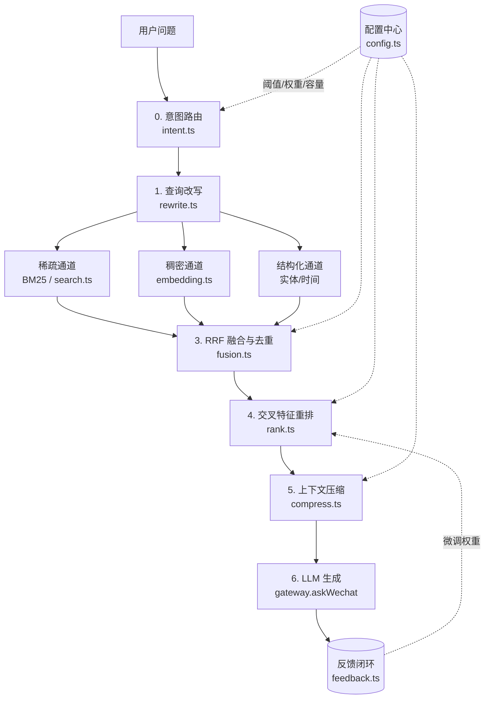

# 微信问答 RAG 检索层 · 架构设计与评估

本文描述「微信问答」检索（RAG）流水线的重构：从**单通道稀疏检索**升级为
**意图路由 + 混合召回 + 融合重排 + 上下文压缩**的多阶段架构，并配套**可量化评估**、
**可配置调参**与**反馈闭环**。

> 阅读顺序建议：§1 目标 → §2 架构 → §9 评估（看效果）→ §11 调参（看怎么改）→ §14 限制。

---

## 1. 目标与改造前的问题

改造前（`query/ask.ts` 的 `retrieveAskCitations`）已经是「规划 → 多词 BM25 → 打分 → 窗口展开」，
但存在结构性缺口：

| 缺口 | 具体表现 |
|---|---|
| 只有稀疏通道 | 只有 BM25 词法匹配；「我一共转了多少笔账」这类问法切不出 `转账` bigram 时直接漏召回 |
| 无意图路由 | 只有一条 `recency` 布尔；聚合类问题与「最近一次」共用一套参数，前者因 topK 太小漏证据 |
| 无融合 | 多路召回各自为政，没有统一的名次融合与一致性信号 |
| 无评估 | 「检索好不好」只能靠人肉体验，任何改动都可能悄悄退化 |
| 无反馈 | 用户觉得答得不对，这个信号完全被丢弃 |
| 参数硬编码 | 20 多个模块级常量散落在 ask.ts，换场景就得改代码 |

改造后覆盖的 6 项能力：①多阶段检索架构 ②召回评估机制 ③意图识别与分类路由
④多路召回融合去重 ⑤反馈闭环 ⑥可配置阈值与参数调优。

---

## 2. 架构总览



编排层是 `pipeline.ts`：它把上述阶段串起来，且**每个阶段都可以单独关闭**
（配置或消融实验），因此既能灰度（`enabled=false` 回退旧路径），也能做对照实验。

---

## 3. 模块职责

| 文件 | 职责 | 关键点 |
|---|---|---|
| `retrieval/types.ts` | 跨阶段共享类型 | `IntentKind` / `ChannelResult` / `FusedDoc` / `RankedDoc` / `RetrievalStats` |
| `retrieval/config.ts` | 参数配置中心 | 默认值 + `rag-config.json` 深合并 + 意图策略合成（`effectiveParams`） |
| `retrieval/intent.ts` | 意图识别与路由 | 确定性规则分类（可离线、可单测）+ LLM 保守修正 |
| `retrieval/rewrite.ts` | 查询改写 | 全角归一、同义扩展、相对时间确定性解析、多查询变体 |
| `retrieval/embedding.ts` | 稠密通道 | provider embedding + SimHash 粗筛 + 本地向量库 + 增量索引 |
| `retrieval/fusion.ts` | 多路融合去重 | RRF（只用名次，免量纲标定）+ 时间感知去重 |
| `retrieval/rank.ts` | 交叉特征重排 | 6 特征线性组合 + `recencyFirst` 硬优先 |
| `retrieval/compress.ts` | 上下文压缩 | 对话窗口化 + 跨窗去冗余 + 字符预算裁剪 |
| `retrieval/eval.ts` | 评估指标 | P@k / R@k / MRR / NDCG@k / AP（纯函数） |
| `retrieval/eval-dataset.ts` | 合成评测集 | 确定性语料 + 人工标注 + 检索适配器 + 消融 |
| `retrieval/feedback.ts` | 反馈闭环 | 反馈库 + 特征归因 + 权重自适应 + 落盘 |
| `retrieval/pipeline.ts` | 编排 | 阶段串联 + 降级 + 统计 |
| `query/grounding.ts` | **生成侧接地核对** | 回答里的金额/日期/长数字必须出自它引用的原文；合计放行、计数不查（见 §19） |

**设计原则**：每一层只通过 `types.ts` 的结构化类型通信，不直接互相 import 实现细节。
这样评估（`eval.ts`）与消融（`eval-dataset.ts`）可以替换任意阶段而不改流水线。

---

## 4. 意图路由（目标 3）

`classifyIntent()` 用规则判定 6 类意图，顺序即优先级；LLM 仅在规则判为 `open_qa` 时才能覆盖
（保守策略：反向覆盖的收益低于风险）。

| 意图 | 触发特征 | 策略差异 |
|---|---|---|
| `recency_lookup` | 最近/最新/最后… | **时间硬优先** + recency 特征加权 |
| `entity_lookup` | 实体+属性词 / 「是谁」 | **实体权重 2.0**，结构化通道 topK 放大 |
| `time_range` | 昨天/上周三/9月3号/上个月 | **timePref 权重 1.6**，稀疏 topK 放大 |
| `aggregation` | 一共/总共/多少次 | **wideRecall=true**：通道 topK 与压缩预算都放大（要覆盖度） |
| `comparison` | 对比/区别/哪个更 | 覆盖度与一致性权重提高 |
| `open_qa` | 其余 | 均衡默认权重 |

> 判定的确定性设计是刻意的：**意图路由是每问必走的路径，不能依赖网络**。
> LLM 规划器挂了、没配 Key、被隐私拦截时，路由仍必须给出合理策略。

---

## 5. 混合检索与隐私边界（目标 1）

### 5.1 三条通道

| 通道 | 实现 | 语料来源 | 特点 |
|---|---|---|---|
| 稀疏 | FTS5 + bigram + BM25（既有 `search.ts`） | 消息分片 | 精确、零出网、对实体/数字强 |
| 稠密 | provider `/embeddings` + 余弦 | **复用稀疏索引的同一份文本** | 语义泛化，补词形不匹配 |
| 结构化 | who 列（实体）+ 时间窗过滤 | 同上 | 问某人 / 问某天时的精确召回 |

**关键设计**：稠密通道读的是 `wechat_search.db` 的 `message_meta`，与稀疏**同一份文档集与 docKey**。
好处是融合阶段不会出现「同一消息两个 id」的重复，且首次提问天然串行（先建稀疏索引，再基于它建向量索引）。

### 5.2 隐私边界（重要）

稠密检索需要把文本发给 embedding 接口 —— 这是**在原有基础上新增的出网点**。
因此：

- 所有 embedding 调用统一经 `gateway.makeEmbedFn()` → `privacyGate('ask_embed')`；
- 开启「**出站拦截**」时 embedding 抛错，流水线**自动降级为纯稀疏**，问答仍可用；
- 开启「**敏感字段脱敏**」时发送脱敏后的文本，并写隐私审计；
- 未配置 embedding（无 Key / 无向量模型）时同样静默降级，不报错。

> 注意与生成阶段的区别：生成阶段本来就把**检索到的 top-K** 发出去；
> 而建向量索引会把**全量消息**逐条发出去。这就是为什么新增了 `ask_embed` 审计项，
> 且在配置里保留了 `embedding.enabled` 一键关闭。

### 5.3 向量检索提速

全量精确余弦对 13 万条太慢。方案：每个向量额外存一个 **64 位 SimHash 签名**
（固定种子随机超平面，索引/查询两侧一致，零额外依赖）。查询时：

1. 加载 `(rowid, hash)` 到内存（≈130k × 16B ≈ 2MB，按 mtime 缓存）；
2. 汉明距离升序取 `candidatePool` 条 —— 用**计数选择**（一遍算距离 + 65 格直方图 + 一遍稳定
   计数排序，见 `selectByHamming`），不做全量 `sort`：要的只是前 `candidatePool` 名
   （几十到几百），而表有十几万行，全量比较排序得不偿失（实测 13.5 万行：15.5ms → 1.2ms）；
3. 仅对幸存者做精确余弦。

这把「全量 130k 次点积」降到「130k 次 popcount + 2k 次点积」。

> 注：这一步省下的是**毫秒级**的 CPU 时间；一次真实检索的墙钟时间主要由 embedding 网络往返
> （几百 ms 量级）决定，别把它说成端到端加速。同一路径上还有两处 per-query 的 O(N) SQL
> （`vectorIndexStatus` 会为一次提问重开两次连接并各做一次 `COUNT(*)`，实测各 ≈1.25ms），
> 已登记为 N14。

---

## 6. 多路融合与去重（目标 4）

用 **RRF（Reciprocal Rank Fusion）**：`score(d) = Σ_channel 1 / (k + rank_channel(d))`。

**为什么不用分数加权求和**：BM25 分无上界、余弦在 [-1,1]，量纲不同必须归一化，
而归一化对异常值极敏感（一条超长文档能把 BM25 的归一化尺度带偏）。
RRF 只用名次，免标定，且被多通道同时召回的文档自动获得累加优势 —— 这正是「一致性」信号。

**去重分两层**：
1. RRF 阶段按 `docKey`（`username:local_id`）合并同一消息的多通道命中；
2. `dedupeFused` 合并文本近似重复的消息，**但必须叠加时间邻近**（默认 5 分钟内）。

> 第 2 条的时间条件是被评测逼出来的修复：微信系统通知是模板化的
> （「微信转账 收到转账3500.00元」逐月重复），纯文本相似度去重会把
> 「一共转了多少笔账」里的多笔转账合并成一条 —— 实测吞掉了 9 月那笔。

---

## 7. 重排特征与权重

`rank.ts` 计算 6 个归一化到 0~1 的特征，线性组合成最终分：

| 特征 | 含义 | 默认权重 |
|---|---|---|
| `sparse` | 稀疏通道归一化分 | 1.0 |
| `dense` | 稠密余弦分 | 0.9 |
| `entity` | 命中意图实体（会话名/发言人/正文） | 1.2 |
| `coverage` | 命中词项的加权覆盖率（稀有词权重更高） | 0.8 |
| `timePref` | 落在推断时间范围内 | 0.6 |
| `recency` | 时间新鲜度（30 天半衰期指数衰减，仅 recency 类生效） | 0.5 |
| `agreement` | 多通道一致性 `(通道数-1)/2` | 0.4 |

**`recencyFirst` 硬优先**：问「最近一次 X」时，命中足够多内容词的候选直接按
 
时间新→旧排序，不走加权。这是旧实现踩坑最多的地方（BM25 偏好「短文本+词重复出现」的讨论型消息，
会把群里讨论转账脚本的消息排到真正的转账通知前面）。

---

## 8. 上下文压缩

1. **窗口化**：命中的单条消息展开成所在对话窗口（微信里「我没答应」单独一条无法回答
   「谁答应过什么」，答案往往分散在相邻两三条里）；
2. **跨窗去冗余**：同一句已在别的窗口出现过就不再重复（锚点除外，保证引用可定位）；
3. **预算裁剪**：按字符预算贪心装填（默认 6000 字符）；`wideRecall` 意图（聚合/对比）
   自动放宽 1.5×。

---

## 9. 评估体系（目标 2）

### 9.1 指标

| 指标 | 含义 | 关注点 |
|---|---|---|
| `Precision@k` | top-k 里相关比例 | 噪声控制 |
| `Recall@k` | 相关文档被召回比例 | 漏召控制 |
| `MRR` | 首个相关结果名次倒数 | 「答案排多前」 |
| `NDCG@k` | 名次折扣排序质量 | 越靠前越吃分 |
| `AP/MAP` | 平均精度 | 整体排序质量 |

全部是**纯函数**（输入有序 docKey 列表 + 相关集合），与数据库无关，因此既能跑合成语料也能跑人工标注。

### 9.2 合成评测集

`eval-dataset.ts` 提供一份**确定性**小语料（28 条消息 / 4 个会话）+ 7 个标注用例，
刻意覆盖真实踩过的难例：

- 「最近一次转账给谁」—— 群里有讨论转账脚本的干扰消息（排在更早的 8 月，用于验证时间优先）；
- 「李四的电话」—— 实体 + 属性双层匹配；
- 「上周三和李四聊了什么」—— 相对时间解析成绝对日期；
- 「合同差额2000的客户是谁」—— 数字 + 实体组合；
- 「我一共转了多少笔账」—— 分词切不出 `转账` bigram 的极端情形。

评测适配器复现真实的**融合 + 重排**逻辑，稠密通道用「字符 bigram 余弦」作为
**零依赖本地代理**（可离线跑 CI）；真实运行时换成 provider embedding（接口形状一致）。

### 9.3 实测结果

```
混合（稀疏+稠密+结构化）  P@10=20.0%  R@10=100.0%  MRR=1.000  NDCG@10=0.967  MAP=0.933
消融（仅稀疏）           P@10=14.3%  R@10= 76.2%  MRR=0.857  NDCG@10=0.781  MAP=0.762
意图分类准确率            7/7 = 100.0%
```

可随时用 `npm run rag:smoke` / `npm run rag:check` 复现。

---

## 10. 反馈闭环（目标 5）

- 用户对回答赞/踩，并可标注**哪几条引用有用/没用**；
- 反馈只存**特征归因**（哪些特征名），不存消息正文 —— 反馈库本身不成为隐私风险；
- `attributeFeatures()` 比较「有用引用」与「无用引用」的特征均值，取差异 > 0.1 的特征；
- `adaptWeights()` 按 `rating` 对归因特征做 ±`learningRate` 微调，clamp 到 [0.05, 3.0]；
- **权重由全部历史反馈重算并落盘**（幂等、可重放），而不是在旧值上累加 —— 累加会因重复提交而漂移。

链路：`askWechat` 返回 `retrievalId` → 前端回传 `submitAskFeedback({ retrievalId, rating, useful, useless })`。

---

## 11. 配置与调参（目标 6）

配置位于 **`<数据根>/rag-config.json`**（与 `wechat_search.db` 同级；数据根 = 解密目录的父目录）。
三层优先级：内置默认 → `rag-config.json` → 运行时覆盖（意图策略 / 反馈权重）。

> **⚠️ 产品决策（2026-09-17）：这一节描述的参数，界面上一个都不再暴露。**
> 原「检索设置（RAG）」面板已下线。目标用户不需要（也不该）知道 RRF 常数、相似度下限、
> 权重微调步长是什么 —— 下表的值就是**出厂即用的最优默认**：用户零配置即获得完整能力，
> 包括稠密通道（首次提问时网关自动增量建索引，见 §20）。
> `rag-config.json` 仍可手工编辑（运维 / 排障），但**应用内没有任何入口**；
> 回归由 `scripts/ui-ask-smoke.tsx` 的源码级闸门（面板文件是否回来、Ask 是否又挂上入口）
> 与 `ui:accept` 步骤 2 共同守住。

| 参数 | 默认 | 说明 / 调参建议 |
|---|---|---|
| `enabled` | true | 总开关；false 时回退旧单通道检索（灰度/回滚） |
| `channels.sparse.topK` | 400 | 稀疏候选数。召回不足先加这个 |
| `channels.dense.topK` | 200 | 稠密候选数 |
| `channels.dense.minSimilarity` | 0.2 | 余弦下限。噪声多则上调到 0.3~0.4 |
| `channels.dense.candidatePool` | 2000 | SimHash 粗筛池。越大越准越慢 |
| `fusion.k` | 60 | RRF 平滑；调小更强调头部名次 |
| `fusion.keep` | 120 | 融合后进入重排的候选数 |
| `rerank.weights.*` | 见 §7 | 特征权重；按场景调（实体场景抬 `entity`） |
| `compress.maxChars` | 6000 | 上下文预算；模型上下文大且证据稀疏时可上调 |
| `compress.dedupThreshold` | 0.85 | 近似重复阈值（配合 5 分钟时间窗） |
| `embedding.enabled` | true | 稠密开关；隐私敏感场景可关 |
| `embedding.batchSize` | 16 | embedding 批大小（厂商 batch 上限） |
| `embedding.maxDocsPerBuild` | 40000 | 单次增量索引上限（防止首次提问卡太久） |
| `feedback.learningRate` | 0.08 | 权重微调步长 |
| `intent.llmAssist` | false | 是否用 LLM 辅助意图分类（默认关，省一次往返） |

**调参工作流（运维 / 研发侧，非用户侧）**：改 `rag-config.json` → `npm run rag:check`
看指标是否退化 → 必要时直连 `evaluateRetrieval` 做混合/稀疏消融对比。
`ui:accept` 的步骤 3 / 8 / 9 就是用这套方式造场景的（网关每次提问都重新读配置，无内存缓存，
所以文件写完立刻生效）。

---

## 12. 降级与可观测性

**降级链**（任一环节失败都不阻断问答）：

```
embedding 未配置 / 被拦截 / 失败  →  稠密通道 active=false，纯稀疏继续
向量索引未就绪 / 建索引失败       →  同上
结构化通道无实体无时间            →  该通道不参与融合
LLM 规划器失败                    →  退化为用原问题 bigram 检索
配置 enabled=false                →  回退旧单通道检索
```

**可观测性**：
- 操作日志写「意图 / 各通道命中数 / 召回→融合→重排→窗口 漏斗 / 耗时」；
- `AskResult.retrieval` 返回 `intent / denseActive / channels / funnel / elapsedMs`；
- `AskResult.retrievalId` 供反馈归因；
- `getRetrievalStatus` 暴露配置、向量库规模、反馈统计、意图自评。

---

## 13. 集成一览

**新增 Remote 方法**（本轮 7 个；本节当时记的方法数早已不是当前值。
⚠️ 2026-09-15 核对：那之后又加了知识图谱等一批，**当前总数是 132** ——
权威值以 `src/backend/wechat-data/src/gateway.ts` 的 `@Remote` 为准，
自动生成的方法清单见 `docs/API.md`（一致性由 `npm run docs:api:check` 与
`src/backend/tests/api-docs.spec.ts` 守住）。下表的「7 个」指本次新增，不是总数）。

| 方法 | 用途 |
|---|---|
| `getRetrievalStatus` | 配置 + 向量库 + 反馈 + 权重 + 意图自评 |
| `saveRetrievalConfig` | 保存阈值/权重/容量 |
| `buildRagVectorIndex` | 立即构建/重建向量索引 |
| `submitAskFeedback` | 提交反馈 → 归因 → 调权 |
| `listRetrievalFeedback` | 反馈列表 + 统计 |
| `resetRetrievalWeights` | 权重回默认 |
| `evaluateRetrieval` | 跑合成评测 + 混合/稀疏消融 |

> 这 7 个方法**都没有界面入口**（2026-09-17 起）：`submitAskFeedback` 仍由每条回答下方的
> 👍 / 👎 正常调用；其余 6 个（状态查询 / 保存配置 / 建索引 / 反馈列表 / 重置权重 / 离线评估）
> 只供诊断、自动化测试与将来的高级模式使用。`ui:accept` 相应改为**直连 IPC** 验证它们仍在，
> 并把「界面上没有入口」作为独立断言。

**其他改动**：
- `gateway.askWechat`：检索段替换为 `runRetrievalPipeline`（`enabled=false` 时走旧路径）；
- `wechat-host.js`：LLM 桥新增 `embed()`（OpenAI 兼容 `/embeddings`）；`llm.json` 新增
  `embeddingModel` / `embedPath`；
- `scripts/build-wechat-bundle.js`：本地用 esbuild 重建 `lib/index.js`
  （**运行时只读 bundle，改 src 必须重建**；装饰器必须走 TC39 语义）。

### 13.1 前端集成（「微信问答」面板）

| 界面元素 | 位置 | 作用 |
|---|---|---|
| 检索漏斗行 `RetrMeta` | 每条 AI 回答的规划行下方 | 意图 / 各通道命中数 / 召回→融合→重排→窗口 / 耗时；**稠密降级时显式告警** |
| 回答反馈 `AnswerFeedback` | 每条 AI 回答的来源列表下方 | 👍 一键提交；👎 展开逐条标注「有用 / 没用」再提交 |
| ~~检索设置栏 `RetrievalPanel`~~ | — | **已移除**（2026-09-17）：参数固化为产品默认值，界面不再暴露任何可调项；组件与死样式一并删除，稠密索引改为首次提问自动构建 |
| 向量模型输入 | 模型配置栏 | `embeddingModel`（留空则复用对话模型） |

`api.ts` 新增 7 个 RAG 函数（与后端 Remote 方法一一对应），`WechatLlmConfig` 补
`embeddingModel` / `embedPath`，并补齐了 `askWechat` 类型里缺失的 `streamId`。
（2026-09-17 起这 7 个包装里只有 `apiSubmitAskFeedback` 仍被界面调用；其余 6 个保留为
「与后端 Remote 对齐的诊断面」，**不许接线到界面** —— `ui:ask-smoke` 有守卫扫这个。）

### 13.2 验证矩阵

| 命令 | 覆盖 | 依赖 |
|---|---|---|
| `rag:check` | 检索层纯逻辑 20 项断言（意图 / 改写 / 融合 / 去重 / 重排 / 指标 / SimHash / 评测回归） | 无（esbuild 现场 bundle） |
| `rag:smoke` | 后端 bundle 加载 + 7 个新 Remote 方法 + 评估报告 | 无（不启动 Electron） |
| `ui:smoke` | 新 UI 组件 SSR 渲染 35 项断言（`splitMarks` 分组、漏斗行降级告警、反馈三态、会话 AI 面板空/全屏态…）+ **源码级回归闸门**：检索面板组件已删、Ask 不再有「检索」入口、界面不再调用任何检索配置类接口 | 无（react-dom/server + 读源码） |
| `ui:accept` | 真实应用端到端 11 步 / 70 断言（含「会话级 AI 对话」整条链路） | playwright + 本地 mock LLM |
| `build:ui` | 全量前端编译（817 模块 → `ui-dist/`） | 内嵌 esbuild |

**命令**：`npm run build:backend` · `npm run build:ui` · `npm run rag:check` ·
`npm run rag:smoke` · `npm run ui:smoke` · `npm run ui:accept`

---

## 17. 会话级 AI 对话（群聊 / 单聊内嵌）

在会话里直接问「这段聊天」，而不是跳到全局问答页签再手选范围。

**形态**：聊天头部新增「AI 问答」按钮（与 实时/日历/群信息 同排）→ 右侧展开
「新对话」面板（第三栏，与消息流并排、互不遮挡）；`⛶` 可全屏（消息流让位，
会话列表保留以便换会话）。

**范围绑定**：面板的「读取范围」把检索限定到某个 `username` —— 复用既有
`askWechat({ username })`，**没有第二条检索实现**。范围**恒为当前打开的会话、只读展示**
（曾有过下拉与「跟随聊天」开关，已去掉）：面板与右侧消息流是同一个会话，两者必须一致，
否则会出现「看着 A 的聊天、问的却是 B」这种用户无法自证的错位。
切到别的会话时面板自然跟着换；每个会话各留一份对话上下文（`useAskSession` 按 `threadKey` 分线程）。

**可见性**：只对单聊与群聊显示入口；公众号/服务号/客服是单向广播，问答没有语义。

**共用而非复制**：Ask.tsx 里的问答链路（流式 id 隔离 / 多轮历史裁剪 / 错误态 / 引用归属）
抽成 `panels/use-ask.ts`，全局问答页签与群聊面板共用。回归证据：`ui:accept` 里
步骤 1/6/7/8/9 是全局问答面板的原有断言，重构后全部照旧通过。

**模型下拉**：列出厂商可用模型，选中即写回 `llm.json` 的全局默认模型（后端问答用的就是它）。
推理档位（截图里的「适中」）与第三个图标**按约定未实现**——后端没有该概念，不做点了没反应的控件。

**新增文件**：`panels/SessionAsk.tsx`、`panels/session-ask.module.css`、`panels/use-ask.ts`。

---

## 18. AI 模型配置统一到「微信数据配置」

改造前同一份 `wechat/llm.json` 有 **4 个入口**各配一遍，彼此不一致也无人知晓：
微信问答的模型侧栏、会话 AI 的「默认模型」下拉、检索设置里的「向量模型」、每日总结的
provider/model 选择器。现在**只剩一处**：

| 位置 | 内容 |
|---|---|
| **微信数据配置 → AI 大模型**（`panels/AiModelConfig.tsx`） | 厂商模板 / 供应商 / 模型 / API Key / base_url / 向量模型 / 获取官方模型 / 保存；卡片徽标显示当前已配置模型 |
| 微信问答 | 无模型入口（原侧栏与上下文条的模型 chip 已删）；检索设置只留通道开关与阈值，并注明向量模型去哪配 |
| 会话 AI 对话 | 输入区无模型下拉，仅一行「模型在『数据配置』中设置」 |
| 每日/周期总结 | 无 provider/model 选择器，统一用全局默认模型（`generateDailySummary({ date })`） |

**可见性校验**：`ui:accept` 步骤 11 断言卡片含全部字段且显示当前模型，并回到问答面板断言
「无模型 chip、无『未配置模型』提示」；步骤 10 断言会话 AI 面板内 `combobox` 数为 **0**。
步骤 2 的判据落在**输入控件**上（`textbox` 数为 0）而不是文案 —— 因为面板提示里会出现
「向量模型」四个字，查文本会误判。

---

## 19. 回答接地闸门与命名实体识别（2026-09-15）

本节记录一次以「**回答必须只依据本机微信消息**」为目标的加固。检索层（§4–§8）决定
「能不能找到证据」，本节解决另外三件事：**证据在不在范围里**、**送进去的材料够不够让模型
照着说**、**模型说出来的值是不是真的出自材料**。

### 19.1 生成侧接地核对（`query/grounding.ts`）

提示词里的「只用材料里的事实」是**软**约束；前端 `panels/utils/grounding.ts` 的提示
只在界面上提醒、不拦截也不改写（刻意的：金额可能是正当的合计）。本节补的是**生成侧**的
确定性核对：拿回答里的高风险值与**回答自己引用的那几条原文**逐项对照。

| 值类型 | 规则 | 为什么 |
|---|---|---|
| 金额（带 `元/块/万/圆`） | 必须等于引用原文里的某个数字；**或**等于原文里 ≤3 笔金额之和 | 最高风险（直接影响用户判断），且绝大多数写在原文里 |
| 日期（`YYYY-MM-DD` / `YYYY年M月D日`） | 必须与引用原文里出现过的日期同日 | 每条窗口头都带日期，不需要模型推算 |
| 长数字串（≥7 位） | 必须能在引用原文里逐字找到 | 手机号/卡号/单号只可能来自原文 |

**刻意不查**：计数（「一共 3 笔」）与求和本身 —— 它们是模型可以正当算出来的，
拿它们当编造会天天误报，提示很快就没人看了。

**日期与时钟里的数字不算金额出处**：`2026-09-05`、`20:12` 会先被标记为「时间片段」，
再扫数字时跳过。否则时钟里的 `14` 与 `12` 相加就能凑出 `2026`，
「他转了 2026 元」会被原文里的日期放过 —— 这条漏洞是写单测时才发现的。

**触发的动作**：核对不通过（有查无出处的值）或「带高风险值的句子没标 `[n]`」→ 带着
**具体是哪几个值不对**回炉重写一次（`groundingRepairHint` 会点名值，并给出「合计要写
加数」的出路）。重写稿只在**确实更好**（无出处的值变少，或引用条数变多）时替换，
避免「越改越糟」。仍然没有任何 `[n]` 才**不予采用**（沿用 §12 的硬约束一/二）。
金额不做硬拦截 —— 拦住合法的合计会把「一共转了多少」直接变成无法回答。

核对结果随 `AskResult.grounding` 返回（`checked / unsupported / cited / repaired`），
并写进操作日志，便于追问「这轮到底核对了什么、为什么被要求重写」。

### 19.2 逐行日期：让模型不需要猜

改造前只有窗口头带锚点那天的日期，窗口内的行只有 `HH:MM`；而提示词又要求「时间写绝对
日期」。窗口跨天时（±15 分钟窗口正好压在午夜上）模型只能拿锚点日期去猜 —— 这正是日期
编造的来源。现在 `CompressedChunk.lines` 的每一行都带自己的 `day`，`formatAskContext`
只在**与窗口头不同天**时才渲染 `MM-DD HH:MM`（保持上下文紧凑）。

### 19.3 会话范围必须收住实体通道（串台修复）

`structuredChannel` 用 `who:` 命中「与某人的往来」，而 `who:` 是**跨会话的全库过滤**。
改造前这条通道**没有带上 `scope.username`**，于是：

- 在「会话内 AI 面板」问当前会话（`scope.username` = 该会话）时，
  同一个人在**群里**的发言也会被召回进来当证据；
- 用户在微信问答里选定某个会话时同理。

现在结构化通道与会话范围一起下发（`searchIndexBatch(..., { username, person })`），
证据全部落在所问会话内。回归见 `tests/ask-grounding.spec.ts`：先证明「不限定会话时
`who:` 确实会跨会话命中」，再断言限定后只剩该会话。

### 19.4 点名识别走本地名单

规划器（LLM）是尽力而为的：它偶尔会漏掉问题里明确点到的人（或整段规划失败），此时检索
退化成纯 bigram 词法匹配。现在 `search.ts#knownEntityNames` 把**联系人备注/昵称 + 会话标题**
交给检索层（`classifyIntent` 的实体规则、`buildQueryPlan` 的实体回退、实体通道），
点名识别变成确定性的；名单按数据目录缓存在 `gateway._knownEntities`，每次提问不再重读联系人库。

### 19.5 规划器短语按整词检索

`extractAskTerms` 会把规划器关键词拆成 bigram。对「收到转账」这种短语，拆分同时引入了
**跨词噪音**（收到/到转/转账，其中「到转」是纯噪音）。现在 3–8 字、不含空格的关键词会
**原样保留一份**放在词表最前（上限 4 个）：检索侧 `ftsPhrase` 把它编成「连续 bigram 短语」，
命中要求整词连续出现 —— 精度高得多；拆出来的 bigram 仍在表里兜住换词/断行的召回。

### 19.6 评测集与真实 FTS 对齐

合成评测（`eval-dataset.ts`）的稀疏通道此前按 bigram 逐个比对，而真实 FTS 对多字词项是
**连续短语**语义（"收到 到转 转账"）。这会让「短语项永远命中不了」，把算法缺陷误判成
评测集特性（反之也会高估单词项）。现在评测里的 tf/df 按整词出现计算，与检索侧同源。
`npm run rag:check` 的合成回归指标不变（P@10 20.0% / R@10 100% / MRR 1.000 / NDCG 0.967，
纯稀疏 14.3% / 76.2% / 0.857 / 0.781），说明这次对齐没有把评分口径改松。

### 19.7 回归证据

| 判据 | 位置 |
|---|---|
| 金额/日期/长数字的「有出处 / 无出处 / 合计放行 / 计数不查 / 越界引用 / 回炉提示」 | `tests/ask-grounding.spec.ts`（12 例） |
| 跨天窗口逐行日期渲染（且锚点当天不重复） | `tests/ask.spec.ts` |
| 会话范围收住实体通道（先证明跨会话命中存在，再断言收住） | `tests/ask-grounding.spec.ts` |
| 规划器短语整词进词表 + 过长短语不整词保留 | `tests/retrieval.spec.ts` |
| 合成评测不回退 | `npm run rag:check` |

**未验证**：真实数据下的端到端效果（回炉重写率、金额误报率）需要跑一次
`npm run ui:accept` 与一段时间的真实问答来标定；本次只做到「纯逻辑单测 + 合成评测 + 类型门禁」。

---

## 14. 已知限制与后续优化

1. **稠密索引是全量出网**：隐私取舍已在 §5.2 说明；后续可考虑本地 ONNX 小模型
   （代价是数 MB~百 MB 原生依赖），或只对「稀疏召回的候选」做稠密重排（减少出网量与成本）。
2. **中文分词仍靠 bigram 近似**：`extractAskTerms` 无分词器；已在评测里用 `subQueries`
   模拟规划器规避，但真实链路里规划器质量直接决定召回上限。可考虑内置一个轻量词典分词。
3. **SimHash 粗筛是有损的**：`candidatePool` 太小会漏掉语义近但哈希远的文档；
   当前 2000 的池子在 13 万规模下足够，语料继续增长后需要评估是否上 IVF/HNSW。
4. **意图规则需要维护**：微信语料的口语变体多，规则命中率会随语料漂移；
   `intent.llmAssist` 是兜底，但会多一次出站往返。
5. **合成评测集规模小（7 例）**：足以做回归护栏，但不能反映真实分布；
   建议后续用真实数据人工标注扩到 50+ 例（并放入不随应用分发的私有目录）。
6. **反馈冷启动**：反馈少时权重调整意义有限；`learningRate` 与 `maxRecords` 需要按实际使用量再标定。
7. **向量库无增量删除**：消息被删/编辑后旧向量仍在；当前靠 `buildRagVectorIndex({force:true})` 全量重建。

---

## 15. 尚未验证 / 待办

- **未在真实 Electron 窗口里点过**：本环境无法启动 GUI，新 UI（漏斗行、反馈按钮、检索设置栏）
  只做到「编译通过 + SSR 渲染断言 + 打包产物含新代码」，**交互与视觉尚未实机确认**。
  建议首次启动时重点看：① 检索设置栏在 ≤900px 下是否与对话栏正确对换；
  ② 👎 标注面板在引用较多时是否滚动正常；③ 稠密降级告警是否只在真的降级时出现。
- **向量索引首次构建未在真实数据上压测**：`maxDocsPerBuild=40000` 是按 13.5 万条语料估算的
  单次上限，真实数据的 embedding 延迟（以及厂商 batch 上限）需要实测后调整。
- **反馈权重自适应未在真实反馈量下评估**：`learningRate=0.08` 是经验值，
  需要几十条真实反馈后回看权重是否跑偏（可用「重置权重」一键回退）。

---

## 16. UI 自动化验收（2026-09-13 执行）

> ⚠️ **本节是 2026-09-13 的历史记录**，其中「检索设置面板 / 面板上的开关与按钮」这一界面形态
> 已于 2026-09-17 下线（见 §20）。当前脚本 `scripts/ui-acceptance.mjs` 的步骤 1–9 已改写为
> 「界面无入口 + 直连 IPC / 直接改配置」，本节保留原样以留档当时的证据与缺陷。

验收脚本：`scripts/ui-acceptance.mjs`（`npm run ui:accept`）。用 Playwright 的
**Electron 驱动**驱动真实应用（真实数据目录 / 真实许可 / 真实 ui-dist 与后端 bundle），
LLM 用**本地 mock**（`127.0.0.1`）替换，因此「问答 → 漏斗行 → 反馈」全链路可跑，
且不把聊天数据发给任何外部厂商。

### 16.1 执行步骤与结论

| # | 步骤 | 判定标准 | 结果 |
|---|---|---|---|
| 1 | 应用启动与问答面板可达 | 导航到面板、会话徽标/输入框/检索 chip/模型 chip 均渲染 | ✅ 5/5 |
| 2 | 检索设置面板与实时状态 | 标题/概览三格/4 开关/向量模型/4 阈值/6 动作齐全；面板与对话栏并排不遮挡 | ✅ 11/11 |
| 3 | 阈值保存落盘 | `fusion.k` 落盘为 37，且**未暴露参数不被重置** | ✅ 4/4 |
| 4 | 稠密通道向量索引构建 | 点击后进入 busy → 出现「构建完成」→ 向量库 >0 → 真实调用 embedding | ✅ 5/5 |
| 5 | 召回评估机制 | 报告含 P@10/R@10/MRR/NDCG@10/MAP + 消融对照 + 意图准确率；混合 MRR ≥ 纯稀疏 | ✅ 9/9 |
| 6 | 问答全链路与漏斗可视化 | 回答渲染、来源列表、漏斗行（路由/稀疏/稠密/召回→融合→重排→窗口/耗时）、未降级 | ✅ 9/9 |
| 7 | 反馈闭环 | 👎 展开标注 → 标「没用」→ 提交 → 「已反馈」→ 列表可见 → 权重落盘 | ✅ 7/7 |
| 8 | 降级：关闭稠密通道 | 漏斗行出现「稠密通道未生效（纯稀疏）」 | ✅ 2/2 |
| 9 | 灰度回退：总开关关闭 | 不再产生漏斗行（走旧单通道检索）但引用照常返回 | ✅ 3/3 |
| 10 | 运行期无渲染错误 | 无 React/pageerror | ✅ 1/1 |

**总判定：✅ 通过（10/10 步骤、56/56 断言）**

> ⚠️ **遗留副作用（2026-09-17 清理）**：步骤 3 当时往**真实** `rag-config.json` 写了非默认的
> `fusion.k=37`，而还原逻辑不覆盖该字段 ⇒ 本机长期残留 37（文档默认值应为 60）。
> 影响面很小（`k` 只调 RRF 平滑强度），但它让「磁盘配置 = 产品默认值」这个前提不再成立。
> 已在本轮把磁盘值改回 60、给验收脚本加了「只写文档默认值」的注释与约束，
> 并在 `retrieval.spec.ts` 补了一组**默认值契约用例**把 §11 的参数表钉住。详见 §20.2。

### 16.2 本次验收发现并修复的缺陷

1. **`makeDeltaEmitter is not defined`（严重，原有缺陷）** — `gateway.ts` 把实例方法
   `this.makeDeltaEmitter(...)` 写成了裸调用，抛 `ReferenceError`，位置在**综合生成那一刻**。
   后果：**任何提问都在出答案前崩掉，AI 问答从来没有产出过回答**。
   证据：重构前的 bundle 备份里同样是 `makeDeltaEmitter(streamId) {` / `makeDeltaEmitter(options.streamId)`，
   `git diff` 该行无改动 → 与本次 RAG 重构无关，是既有缺陷。
2. **面板保存会重置未暴露参数（中）** — `saveRetrievalConfig` 以**内置默认值**为基准合并，
   于是每点一次「保存检索设置」，`embedding.maxDocsPerBuild`、`channels.sparse.topK`、
   `rerank.weights`、`compress.*` 明细等界面未暴露的参数都被静默重置。
   实测后果：`maxDocsPerBuild` 从 400 变回 40000，单次建索引发出 **2501 次 embedding 请求**。
   已改为以**磁盘现值**为基准合并。

### 16.3 未实现 / 待改进项

| 项 | 说明 | 建议 |
|---|---|---|
| 首次提问会被向量索引构建阻塞 | 开启稠密后第一次提问会同步建索引（上限 `maxDocsPerBuild`，默认 40000 条），期间界面无进度、提问看起来像卡住 | 这条**因为面板下线而更需要收口**：用户已无法「点按钮提前建好」，只能吃这一次同步构建。建议在提问路径上用小上限（如 2000）快速起步 + 给出进度反馈（见 §20.4） |
| 真实语义质量未验收 | mock 向量是字符分桶哈希，只验证链路；`minSimilarity`、`RRF k` 等阈值在真实 embedding 下的最优值未标定 | 配好真实向量模型后跑 `evaluateRetrieval` + 真实标注集再调 |
| 生成质量未验收 | 验收用固定 mock 回答，不评价模型输出 | 属模型能力，不在本功能范围内 |
| 反馈调权未在真实反馈量下验证 | `learningRate=0.08` 为经验值 | 积累几十条真实反馈后回看是否跑偏 |
| ≤900px 窄窗布局 | 已随面板下线而**不再适用**（问答页改回单栏，没有侧栏要对换）；其余页面的窄窗表现仍未验收 | 手动缩放窗口确认各页面无溢出 |

---

## 20. 检索参数固化：面板下线（2026-09-17）

### 20.1 决策与改动

**问题**：§11 那张参数表原本以「检索设置（RAG）」侧栏的形式暴露给用户 —— 里面是
RRF 融合常数、稠密相似度下限、权重微调步长这类**算法内部量**。对目标用户（不写代码、
只想问聊天记录的人）来说，这些既看不懂、也不该需要看懂；更糟的是它们会诱导用户
「先随便调两下试试」，把一个本来开箱可用的功能调坏。

**决策**：**参数全部固化为产品默认值，界面不再暴露任何可调项。**

| 项 | 改前 | 改后 |
|---|---|---|
| 参数来源 | 内置默认 → `rag-config.json` → 面板覆盖 | 内置默认 → `rag-config.json`（**无界面入口**） |
| 入口 | 问答页上下文条的「检索」chip | 已删除（连同面板组件、Esc/外点关闭、两栏侧开布局） |
| 稠密索引 | 需在面板点「增量构建向量索引」 | **首次提问时网关自动增量构建**（本就有此兜底路径） |
| 运维手段 | 面板按钮（保存 / 评估 / 建索引 / 重置权重 / 看反馈） | `rag-config.json` 手工编辑 + 直连 IPC（诊断 / 测试） |

**关键前提**：`gateway.askWechat` 里本来就有一条「向量索引未就绪 → 先建再检索」的懒构建逻辑
（`if (!vst.ready) await buildVectorIndex(...)`，失败只记日志、降级为纯稀疏）。
也就是说面板上那个「增量构建」按钮**从来不是链路必需的**，删掉它不会留下功能缺口。

**改动清单**：

| 文件 | 改动 |
|---|---|
| `panels/RetrievalPanel.tsx` | **删除** |
| `panels/Ask.tsx` | 删 import / `retrOpen` 状态 / Esc 与外点关闭 effect / 「检索」chip / 面板挂载；`ScopeIcon` 去掉 `retrieval` 分支；布局回到单栏 |
| `panels/retrieval.module.css` | 删面板专用类，保留 Ask 仍在用的 `RetrMeta` / `AnswerFeedback` / 反馈标注类（135 → 56 行） |
| `panels/ask.module.css` | 删 `modelPanel` / `askPanelIn` / `panelBack` / `drawerHdRight` 与 `≤900px` 的侧开规则（852 → 806 行） |
| `query/retrieval/config.ts` | **未改** —— 内置默认值本就已经是产品最优值（`k=60`、通道全开、`minSimilarity=0.2`、`maxChars=6000`…） |
| `api.ts` | 6 个 `api*Retrieval*` 包装保留为诊断面，注释写明「**不要接线到界面**」 |
| `scripts/ui-ask-smoke.tsx` | 新增源码级回归闸门（见 20.3） |
| `scripts/ui-acceptance.mjs` | 步骤 1–9 由「点面板」改为「断言界面无入口 + 直连 IPC / 直接改配置」 |

### 20.2 顺手修掉的遗留副作用：`fusion.k=37`

磁盘上的 `rag-config.json` 里 `fusion.k` 是 **37**，而不是 §11 写的默认值 60。
来源是 §16.1 步骤 3：验收脚本为了验证「落盘」把输入框填成 `37`，但还原逻辑只覆盖了
`rag-config.json` 的整文件备份路径，**没有覆盖这个被改写的字段**，于是 37 一直留在盘上。

本轮：磁盘值改回 **60**；验收脚本改为只写文档默认值（并加注释说明理由 —— 万一脚本被中断、
还原没跑到，真实配置里也不会残留一个「只有测试才知道来历」的数字）。
另外在 `retrieval.spec.ts` 补了一组**产品默认值契约用例**：把 §11 参数表里每一个默认值
（`fusion.k=60`、`fusion.keep=120`、`channels.dense.minSimilarity=0.2`、`embedding.maxDocsPerBuild=40000`、
`feedback.learningRate=0.08`、`intent.llmAssist=false` …）逐个断言一遍。这样「文档说 60、
代码是 60、盘上是 60」三者一旦漂移就会红。

### 20.3 回归闸门（为什么不能只靠渲染断言）

面板下线后，真正的风险是**它哪天被挂回来**（有人觉得「加个高级设置挺好」）。
渲染断言只能在面板挂回来、且默认展开时才报警 —— 太容易蒙混（把 `open` 默认改成 `false`
就能骗过）。因此 `ui-ask-smoke.tsx` 断言的是**源码事实**：

1. `panels/RetrievalPanel.tsx` 文件已不存在；
2. `panels/Ask.tsx` 里不再出现 `RetrievalPanel` / `retrOpen` / `setRetrOpen` / `retrChipRef` /
   `kind="retrieval"` / `data-side-open`；
3. 整个 `wechat-data/**` 界面源码（排除 `api.ts` 定义处与 `*.spec.ts`）不再出现任何
   `apiGetRetrievalStatus` / `apiSaveRetrievalConfig` / `apiBuildRagVectorIndex` /
   `apiListRetrievalFeedback` / `apiResetRetrievalWeights` / `apiEvaluateRetrieval` 调用。

第 3 条带**防空转断言**（扫描到的源码文件数必须 > 30）—— 否则路径算错会让它「一条都没命中」
而假通过。

### 20.4 仍未解决 / 需后续决策

- **首次提问的同步建索引**：面板下线后用户失去了「提前建好」的手段，第一次提问的等待更硬。
  建议把提问路径上的建索引上限调小（如 2000 条）并给出进度反馈。
- **「重启后配置不生效」类支持成本**：没有界面入口后，排障只能改文件。
  若将来确实需要「高级模式」，应做成显式的、藏在设置里的开关，而不是回到问答页侧栏。
- **真实阈值未标定**：`minSimilarity` / `fusion.k` 在真实 embedding 下的最优值仍未知
  （mock 向量只验证链路）。固化默认值让这件事从「用户自己摸」变成「我们必须负责」。
